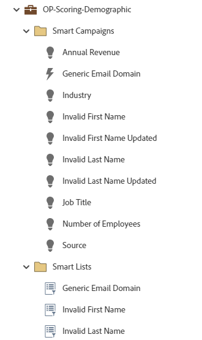

# OP評分人口統計 {#op-scoring-demographic}

這是進階（代碼化）作業方案的範例，利用Marketo Engage預設方案進行人口統計評分。 在方案的「我的Token」索引標籤下檢視和編輯評分值。 需要名為「人口統計分數」的自訂分數欄位。

如需進一步的策略協助或自訂方案，請聯絡Adobe客戶團隊或造訪 [Adobe Professional Services](https://business.adobe.com/customers/consulting-services/main.html){target="_blank"} 頁面。

## 頻道摘要 {#channel-summary}

<table style="table-layout:auto"> 
 <tbody> 
  <tr> 
   <th>管道</th> 
   <th>成員資格狀態</th>
   <th>Analytics行為</th>
   <th>計畫型別</th>
  </tr> 
  <tr> 
   <td>營運</td> 
   <td>01 — 成員</td>
   <td>營運</td>
   <td>預設</td>
  </tr>
 </tbody> 
</table>

## 先決條件欄位 {#prerequisite-fields}

<table style="table-layout:auto"> 
 <tbody> 
  <tr> 
   <th>類型</th> 
   <th>易記名稱</th>
   <th>API名稱</th>
  </tr>
  <tr> 
   <td>分數</td> 
   <td>人口統計分數</td>
   <td>人口統計分數</td>
  </tr>
 </tbody> 
</table>

## 程式包含下列資產 {#program-contains-the-following-assets}

<table style="table-layout:auto"> 
 <tbody> 
  <tr> 
   <th>類型</th> 
   <th>範本名稱</th>
   <th>資產名稱</th>
  </tr>
  <tr> 
   <td>Smart Campaign</td> 
   <td> </td>
   <td>通用電子郵件網域</td>
  </tr>
  <tr> 
   <td>Smart Campaign</td> 
   <td> </td>
   <td>名字無效</td>
  </tr>
  <tr> 
   <td>Smart Campaign</td> 
   <td> </td>
   <td>無效的名字已更新</td>
  </tr>
  <tr> 
   <td>Smart Campaign</td> 
   <td> </td>
   <td>姓氏無效</td>
  </tr>
  <tr> 
   <td>Smart Campaign</td> 
   <td> </td>
   <td>無效的姓氏已更新</td>
  </tr>
  <tr> 
   <td>Smart Campaign</td> 
   <td> </td>
   <td>年收入</td>
  </tr>
  <tr> 
   <td>Smart Campaign</td> 
   <td> </td>
   <td>產業</td>
  </tr>
  <tr> 
   <td>Smart Campaign</td> 
   <td> </td>
   <td>職稱</td>
  </tr>
  <tr> 
   <td>Smart Campaign</td> 
   <td> </td>
   <td>員工人數</td>
  </tr>
  <tr> 
   <td>Smart Campaign</td> 
   <td> </td>
   <td>來源</td>
  </tr>
  <tr> 
   <td>資料夾</td> 
   <td> </td>
   <td>通用電子郵件網域</td>
  </tr>
  <tr> 
   <td>資料夾</td> 
   <td> </td>
   <td>名字無效</td>
  </tr>
  <tr> 
   <td>資料夾</td> 
   <td> </td>
   <td>姓氏無效</td>
  </tr>
 </tbody> 
</table>

## 包含我的Token {#my-tokens-included}

<table style="table-layout:auto"> 
 <tbody> 
  <tr> 
   <th>權杖型別</th> 
   <th>Token名稱</th>
   <th>值</th>
  </tr>
  <tr> 
   <td>分數</td> 
   <td><code>{{my.Annual Revenue - High}}</code></td>
   <td>+15</td>
  </tr>
  <tr> 
   <td>分數</td> 
   <td><code>{{my.Annual Revenue - Low}}</code></td>
   <td>+5</td>
  </tr>
  <tr> 
   <td>分數</td> 
   <td><code>{{my.Annual Revenue - Mid}}</code></td>
   <td>+10</td>
  </tr>
   <tr> 
   <td>分數</td> 
   <td><code>{{my.Generic Email Domain}}</code></td>
   <td>-2</td>
  </tr>
  <tr> 
   <td>分數</td> 
   <td><code>{{my.Industry - High}}</code></td>
   <td>+10</td>
  </tr>
  <tr> 
   <td>分數</td> 
   <td><code>{{my.Industry - Low}}</code></td>
   <td>+6</td>
  </tr>
   <tr> 
   <td>分數</td> 
   <td><code>{{my.Industry - Mid}}</code></td>
   <td>+8</td>
  </tr>
  <tr> 
   <td>分數</td> 
   <td><code>{{my.Invalid First Name}}</code></td>
   <td>-5</td>
  </tr>
   <tr> 
   <td>分數</td> 
   <td><code>{{my.Invalid First Name Updated}}</code></td>
   <td>+5</td>
  </tr>
  <tr> 
   <td>分數</td> 
   <td><code>{{my.Invalid Last Name}}</code></td>
   <td>-5</td>
  </tr>
  <tr> 
   <td>分數</td> 
   <td><code>{{my.Invalid Last Name Updated}}</code></td>
   <td>+5</td>
  </tr>
  <tr> 
   <td>分數</td> 
   <td><code>{{my.Job Title - High}}</code></td>
   <td>+15</td>
  </tr>
   <tr> 
   <td>分數</td> 
   <td><code>{{my.Job Title - Low}}</code></td>
   <td>+5</td>
  </tr>
  <tr> 
   <td>分數</td> 
   <td><code>{{my.Job Title - Mid}}</code></td>
   <td>+10</td>
  </tr>
  <tr> 
   <td>分數</td> 
   <td><code>{{my.Lead Source - High}}</code></td>
   <td>+20</td>
  </tr>
  <tr> 
   <td>分數</td> 
   <td><code>{{my.Lead Source - Low}}</code></td>
   <td>+8</td>
  </tr>
  <tr> 
   <td>分數</td> 
   <td><code>{{my.Lead Source - Mid}}</code></td>
   <td>+10</td>
  </tr>
  <tr> 
   <td>分數</td> 
   <td><code>{{my.Number of Employees}}</code></td>
   <td>+5</td>
  </tr>
 </tbody> 
</table>

## 衝突規則 {#conflict-rules}

* **計畫標籤**
   * 在此訂閱中建立標籤 —  _建議_
   * 忽略

* **具相同名稱的登陸頁面範本**
   * 複製原始範本 —  _建議_
   * 使用目的地範本

* **具有相同名稱的影像**
   * 保留兩個檔案 —  _建議_
   * 取代此訂閱中的專案

* **相同名稱的電子郵件範本**
   * 保留兩個範本 —  _建議_
   * 取代現有範本

## 最佳實務 {#best-practices}

* 每個建立的行銷活動都是最佳實務建立的範例，而非使用案例所特有的。 請記得更新Smart Campaign，以解決您的特定痛點和資料挑戰。

* 請考慮更新此程式範例的命名慣例，以符合您的命名慣例。
