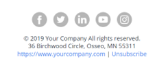

# 快速入門電子郵件範本 {#quick-start-email-template}

Marketo Engage參考資料庫中的部分入門方案包含一個簡單、易於使用且可自訂的電子郵件範本，可讓您在多個行銷使用案例中快速建立電子郵件。

Marketo Engage電子郵件編輯器提供的功能可幫助您變更版面並編輯電子郵件的內容。

* **模組**：編碼至範本的可拖曳/可下拉內容區塊。 它們可以重新組織和複製。

* **文字元素**：您可以使用編輯器更新複製、變更字型樣式或新增連結。

* **影像元素**：與文字元素類似，影像可以交換、連結和調整大小。

* **變數**：選取模組時，變數會出現在編輯器的右側。 如果模組屬性不容易透過影像或文字元素編輯，可使用這些專案來調整模組。

如需進一步的策略協助或自訂方案，請聯絡Adobe客戶團隊或造訪 [Adobe Professional Services](https://business.adobe.com/customers/consulting-services/main.html){target="_blank"} 頁面。

## 模組摘要 {#modules-summary}

### 標誌模組 {#logo-module}

* 包含影像元素以更新標誌
* 包含要控制的變數：
   * 模組的頂端內距
   * 模組的底部內距
   * 模組的背景顏色
   * 標誌對齊
* 

### 影像模組 {#image-module}

* 包含影像元素以更新影像
* 包含要控制的變數：
   * 模組的頂端內距
   * 模組的底部內距
   * 模組的背景顏色
* 

### 標題模組 {#headline-module}

* 包含文字元素以更新標題
* 包含要控制的變數：
   * 模組的頂端內距
   * 模組的底部內距
   * 模組的背景顏色
   * 標題的字型大小（也可以在RTF編輯器中編輯）
   * 標題的字型顏色（這也可以在RTF編輯器中編輯）
   * 標題文字的對齊方式（這也可以在RTF編輯器中編輯）
* 

### 副標題模組 {#subheadline-module}

* 包含文字元素以更新副標題
* 包含要控制的變數：
   * 模組的頂端內距
   * 模組的底部內距
   * 模組的背景顏色
   * 副標題的字型大小（這也可以在RTF編輯器中編輯）
   * 副標題的字型顏色（這也可以在RTF編輯器中編輯）
   * 副標題文字的對齊方式（這也可以在RTF編輯器中編輯）
* 

### 任意文字模組 {#free-text-module}

* 包含文字元素以更新文字
* 包含要控制的變數：
   * 模組的頂端內距
   * 模組的底部內距
   * 模組的背景顏色
   * 文字的字型大小（也可以在RTF編輯器中編輯）
   * 文字的字型顏色（也可以在RTF編輯器中編輯）
   * 文字的對齊方式（也可以在RTF編輯器中編輯）
* 

### cta模組 {#cta-module}

* 包含要控制的變數：
   * 模組的頂端內距
   * 模組的底部內距
   * 模組的背景顏色
   * CTA文字顏色
   * CTA背景顏色
   * CTA邊框顏色
   * CTA邊框半徑(將按鈕圓角化 —  **注意**：此功能在Microsoft Outlook電子郵件使用者端中無法運作)
   * CTA URL
   * CTA文字
   * CTA對齊方式
* 

### 分隔線模組 {#divider-module}

* 包含要控制的變數：
   * 模組的頂端內距
   * 模組的底部內距
   * 模組的背景顏色
   * 分隔線色彩
   * 分隔線高度（畫素）
   * 分隔線寬度(%)
* 

### 頁尾模組 {#footer-module}

* 可用來切換或連結社交圖示的文字元素
* 更新頁尾語言的文字元素
* 包含要控制的變數：
   * 模組的頂端內距
   * 模組的底部內距
   * 模組的背景顏色
   * 文字顏色
   * 內容對齊方式
* 
