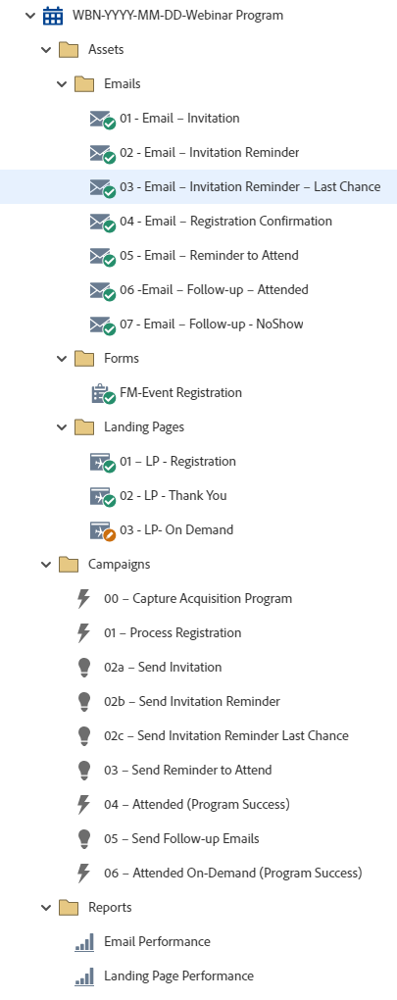

# WBN-YYYY-MM-DD — 網路研討會計畫 {#wbn-yyyy-mm-dd-webinar-program}

這是網路研討會計畫的範例，包含註冊管理、三封邀請電子郵件、提醒參加，以及利用Marketo Engage活動計畫的後續電子郵件。

如需進一步的策略協助或自訂方案的協助，請連絡Adobe客戶團隊或造訪[Adobe Professional Services](https://business.adobe.com/customers/consulting-services/main.html){target="_blank"}頁面。

## 頻道摘要 {#channel-summary}

<table style="table-layout:auto"> 
 <tbody> 
  <tr> 
   <th>管道</th> 
   <th>成員資格狀態</th>
   <th>Analytics行為</th>
   <th>計畫型別</th>
  </tr> 
  <tr> 
   <td>事件</td> 
   <td>01 — 已邀請 
    02 — 已輪候
    03 — 已註冊
    04 — 沒有節目
    05 — 已出席 — 成功
    06 — 出席隨選講座 — 成功</td>
   <td>包含</td>
   <td>事件
   
（整合：活動與網路研討會）</td>
  </tr>
 </tbody> 
</table>

## 程式包含下列Assets {#program-contains-the-following-assets}

<table style="table-layout:auto"> 
 <tbody> 
  <tr> 
   <th>類型</th> 
   <th>範本名稱</th>
   <th>資產名稱</th>
  </tr> 
  <tr> 
   <td>電子郵件</td> 
   <td><a href="/help/marketo/product-docs/core-marketo-concepts/programs/program-library/quick-start-email-template.md" target="_blank">快速入門電子郵件範本</a></td>
   <td>01 — 電子郵件 — 邀請</td>
  </tr>
   <tr> 
   <td>電子郵件</td> 
   <td><a href="/help/marketo/product-docs/core-marketo-concepts/programs/program-library/quick-start-email-template.md" target="_blank">快速入門電子郵件範本</a></td>
   <td>02 — 電子郵件 — 邀請提醒</td>
  </tr>
   <tr> 
   <td>電子郵件</td> 
   <td><a href="/help/marketo/product-docs/core-marketo-concepts/programs/program-library/quick-start-email-template.md" target="_blank">快速入門電子郵件範本</a></td>
   <td>03 — 電子郵件 — 邀請提醒 — 最後機會</td>
  </tr>
  <tr> 
   <td>電子郵件</td> 
   <td><a href="/help/marketo/product-docs/core-marketo-concepts/programs/program-library/quick-start-email-template.md" target="_blank">快速入門電子郵件範本</a></td>
   <td>04 — 電子郵件 — 註冊確認</td>
  </tr>
  <tr> 
   <td>電子郵件</td> 
   <td><a href="/help/marketo/product-docs/core-marketo-concepts/programs/program-library/quick-start-email-template.md" target="_blank">快速入門電子郵件範本</a></td>
   <td>05 — 電子郵件 — 出席提醒</td>
  </tr>
  <tr> 
   <td>電子郵件</td> 
   <td><a href="/help/marketo/product-docs/core-marketo-concepts/programs/program-library/quick-start-email-template.md" target="_blank">快速入門電子郵件範本</a></td>
   <td>06 — 電子郵件 — 後續追蹤 — 已出席</td>
  </tr>
  <tr> 
   <td>電子郵件</td> 
   <td><a href="/help/marketo/product-docs/core-marketo-concepts/programs/program-library/quick-start-email-template.md" target="_blank">快速入門電子郵件範本</a></td>
   <td>07 — 電子郵件 — 後續追蹤 — 不顯示 </td>
  </tr>
  <tr>
  <tr> 
   <td>表單</td> 
   <td> </td>
   <td>FM事件註冊</td>
  </tr>
  <tr> 
   <td>登陸頁面</td> 
   <td><a href="/help/marketo/product-docs/core-marketo-concepts/programs/program-library/quick-start-landing-page-template.md" target="_blank">快速入門LP範本</a></td>
   <td>01 - LP — 註冊</td>
  </tr>
  <tr> 
   <td>登陸頁面</td> 
   <td><a href="/help/marketo/product-docs/core-marketo-concepts/programs/program-library/quick-start-landing-page-template.md" target="_blank">快速入門LP範本</a></td>
   <td>02 - LP — 感謝您</td>
  </tr>
  <tr> 
   <td>登陸頁面</td> 
   <td><a href="/help/marketo/product-docs/core-marketo-concepts/programs/program-library/quick-start-landing-page-template.md" target="_blank">快速入門LP範本</a></td>
   <td>03 - LP — 隨選</td>
  </tr>
  <tr> 
   <td>本地報告</td> 
   <td> </td>
   <td>電子郵件效能</td>
  </tr>
   <tr> 
   <td>本地報告</td> 
   <td> </td>
   <td>登陸頁面績效</td>
  </tr>
  <tr> 
   <td>Smart Campaign</td> 
   <td> </td>
   <td>00 — 擷取贏取計畫</td>
  </tr>
  <tr> 
   <td>Smart Campaign</td> 
   <td> </td>
   <td>01 — 處理註冊</td>
  </tr>
   <tr> 
   <td>Smart Campaign</td> 
   <td> </td>
   <td>02a — 傳送邀請</td>
  </tr>
   <tr> 
   <td>Smart Campaign</td> 
   <td> </td>
   <td>02b — 傳送邀請提醒</td>
  </tr>
   <tr> 
   <td>Smart Campaign</td> 
   <td> </td>
   <td>02c — 傳送邀請提醒最後機會</td>
  </tr>
  <tr> 
   <td>Smart Campaign</td> 
   <td> </td>
   <td>03 — 傳送出席提醒</td>
  </tr>
  <tr> 
   <td>Smart Campaign</td> 
   <td> </td>
   <td>04 — 傳送後續追蹤電子郵件</td>
  </tr>
  <tr> 
   <td>Smart Campaign</td> 
   <td> </td>
   <td>05 — 隨選出席（計畫成功）</td>
  </tr>
  <tr> 
   <td>資料夾</td> 
   <td> </td>
   <td>Assets — 容納所有創意資產 
 (電子郵件、登陸頁面和Forms的子資料夾)</td>
  </tr>
  <tr> 
   <td>資料夾</td> 
   <td> </td>
   <td>行銷活動 — 容納所有智慧行銷活動</td>
  </tr>
  <tr> 
   <td>資料夾</td> 
   <td> </td>
   <td>報表</td>
  </tr>
 </tbody> 
</table>

## 包含我的Token {#my-tokens-included}

<table style="table-layout:auto"> 
 <tbody> 
  <tr> 
   <th>權杖型別</th> 
   <th>Token名稱</th>
   <th>值</th>
  </tr>
  <tr> 
   <td>行事曆檔案</td> 
   <td><code>{{my.AddToCalendar}}</code></td>
   <td>按兩下以取得詳細資料</td>
  </tr>
  <tr> 
   <td>文字</td> 
   <td><code>{{my.DownloadURL-PresentationSlides}}</code></td>
   <td>my.DownloadURL?without=http:// </td>
  </tr>
  <tr> 
   <td>文字</td> 
   <td><code>{{my.Email-FromAddress}}</code></td>
   <td>PlaceholderFrom.email@mydomain.com</td>
  </tr>
  <tr> 
   <td>文字</td> 
   <td><code>{{my.Email-FromName}}</code></td>
   <td><code><--My From Name Here--></code></td>
  </tr>
  <tr> 
   <td>文字</td> 
   <td><code>{{my.Email-ReplyToAddress}}</code></td>
   <td>reply-to.email@mydomain.com</td>
  </tr>
  <tr> 
   <td>文字</td> 
   <td><code>{{my.Event-Date}}</code></td>
   <td><code><--My Event Date--></code></td>
  </tr>
   <tr> 
   <td>RTF文字</td> 
   <td><code>{{my.Event-Description}}</code></td>
   <td>按兩下以取得詳細資訊  
 <code><--My Event Description Here--></code> 
 在[我的Token]索引標籤下方的方案層級編輯此事件說明。 
 您將能學習到： 
<li>專案符號1</li>
<li>專案符號2</li>
<li>專案符號3</li></td>
  </tr>
  <tr> 
   <td>文字</td> 
   <td><code>{{my.Event-Time}}</code></td>
   <td><code><--My Event Time + TimeZone--></code></td>
  </tr>
  <tr> 
   <td>文字</td> 
   <td><code>{{my.Event-Title}}</code></td>
   <td><code><--My Event Title Here--></code></td>
  </tr>
  <tr> 
   <td>文字</td> 
   <td><code>{{my.Event-Type}}</code></td>
   <td>網路研討會</td>
  </tr>
  <tr> 
   <td>文字</td> 
   <td><code>{{my.PageURL-Download}}</code></td>
   <td>my.DownloadURL?without=http://</td>
  </tr>
  <tr> 
   <td>文字</td> 
   <td><code>{{my.PageURL-Registration}}</code></td>
   <td>my.RegistrationPageURL?without=http://</td>
  </tr>
   <tr> 
   <td>文字</td> 
   <td><code>{{my.PageURL-ThankYou}}</code></td>
   <td>my.ThankYouPageURL?without=http://</td>
  </tr>
  <tr> 
   <td>文字</td> 
   <td><code>{{my.Speaker1-Name}}</code></td>
   <td><code><--Speaker Name Here--></code></td>
  </tr>
  <tr> 
   <td>文字</td> 
   <td><code>{{my.Speaker1-Title}}</code></td>
   <td><code><--Speaker Title Here--></code></td>
  </tr>
  <tr> 
   <td>文字</td> 
   <td><code>{{my.Speaker2-Name}}</code></td>
   <td><code><--Speaker Name Here--></code></td>
  </tr>
  <tr> 
   <td>文字</td> 
   <td><code>{{my.Speaker2-Title}}</code></td>
   <td><code><--Speaker Title Here--></code></td>
  </tr>
  <tr> 
   <td>文字</td> 
   <td><code>{{my.Speaker3-Name}}</code></td>
   <td><code><--Speaker Name Here--></code></td>
  </tr>
 <tr> 
   <td>文字</td> 
   <td><code>{{my.Speaker3-Title}}</code></td>
   <td><code><--Speaker Title Here--></code></td>
  </tr>
 </tbody> 
</table>

## 衝突規則 {#conflict-rules}

* **程式標籤**
   * 在此訂閱中建立標籤 — _建議_
   * 忽略

* **名稱相同的登入頁面範本**
   * 複製原始範本
   * 使用目的地範本 — _建議_

* **相同名稱的影像**
   * 保留兩個檔案
   * 取代此訂閱中的專案 — _建議_

* **相同名稱的電子郵件範本**
   * 保留兩個範本
   * 取代現有的範本 — _建議_

## 最佳實務 {#best-practices}

* 如果您使用整合式網路研討會提供者，別忘了將Marketo Engage程式連線到託管系統中的網路研討會。

* 匯入網路研討會計畫後，將表單從本機資產移至位於Design Studio中的全域資產。
   * 減少Design Studio的表單數量並運用更多全域資產，可讓您的程式設計和管理管理擁有更多擴充性。 此外，欄位、選擇加入語言等的定期合規性更新也有彈性。

* 請考慮更新您匯入的程式中的範本，以使用目前品牌的範本，或更新新匯入的範本，以透過新增程式碼片段或適當的標誌/頁尾資訊來反映您的品牌。

* 請考慮更新此程式範例的命名慣例，以符合您的命名慣例。

>[!NOTE]
>
>請記得在程式範本上更新「我的Token值」，並且每次您視需要使用程式時都進行更新。

>[!TIP]
>
>別忘了啟用「05 — 已參加（方案成功）」行銷活動以追蹤成功！ 請在&#x200B;_之前執行此動作，您的電子郵件已寄出。_

>[!IMPORTANT]
>
>參考URL的Token不可包含http://或https:// ，否則連結在資產中無法正常運作。
