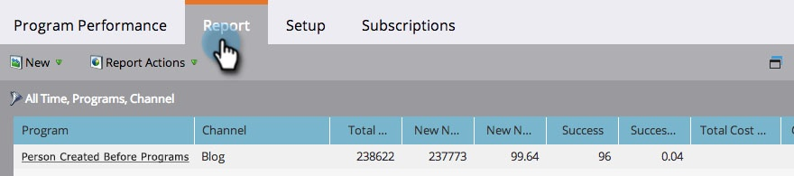

# 新增方案狀態列至方案報告 {#add-program-status-columns-to-a-program-report}

將有關計畫狀態的統計資料新增至您的 [方案效能報告](/help/marketo/product-docs/core-marketo-concepts/programs/program-performance-report/create-a-program-performance-report.md).

1. 前往行銷活動（或Analytics）。

   

1. 選取您的報表。

   

1. 按一下 **設定** 標籤並拖曳至「頻道」標籤上。

   

1. 選取要作為篩選依據的管道。

   

   >[!TIP]
   >
   >若要顯示方案狀態列，您的報告必須依下列條件篩選 _只有一個_ 頻道。

1. 核取顯示計畫狀態列的選項。 按一下 **套用**.

   

1. 您成功了！ 按一下「報表」標籤，檢視含有計畫狀態列的報表。

   

>[!NOTE]
>
>如果您在程式中未看到每個狀態的欄，請確定您已 [已選取要顯示的欄](/help/marketo/product-docs/reporting/basic-reporting/editing-reports/select-report-columns.md) 在報表中。

>[!MORELIKETHIS]
>
>[依標籤篩選計畫報表](/help/marketo/product-docs/core-marketo-concepts/programs/program-performance-report/filter-a-program-report-by-tag.md)
