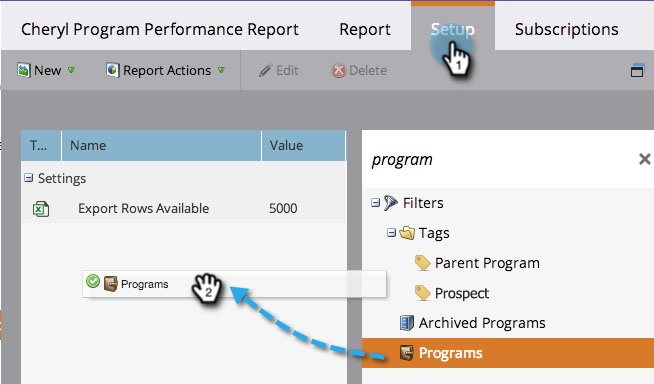

# 按程式{#filter-a-program-report-by-program}篩選程式報告

將[程式效能報告](/help/marketo/product-docs/core-marketo-concepts/programs/program-performance-report/create-a-program-performance-report.md)集中到特定程式上以比較其效能。

1. 前往&#x200B;**Marketing****Activity**（或&#x200B;**Analytics**）。

   

1. 選擇您的方案績效報告。

   

1. 按一下「**Setup**」頁籤並拖動到「**程式**」上。

   

1. 選擇要包含在報表中的資料夾和特定程式。

   

   >[!TIP]
   >
   >如果您選取資料夾，您的報表將包含資料夾在報表執行時包含的所有項目。

1. 就這樣！ 按一下&#x200B;**Report**&#x200B;頁籤，查看報告中選定的程式。__

   

   >[!NOTE]
   >
   >[依標籤篩選程式報表](/help/marketo/product-docs/core-marketo-concepts/programs/program-performance-report/filter-a-program-report-by-tag.md)
