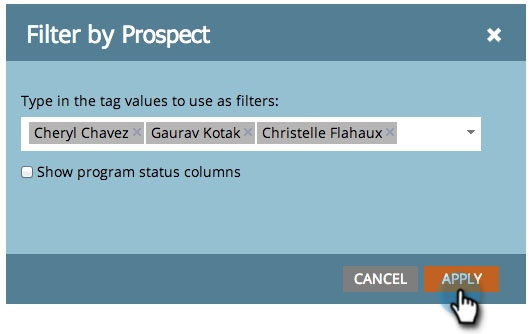

# 依標籤{#filter-a-program-report-by-tag}篩選程式報表

將[程式效能報告](/help/marketo/product-docs/core-marketo-concepts/programs/program-performance-report/create-a-program-performance-report.md)重點放在特定[標籤](/help/marketo/product-docs/core-marketo-concepts/programs/working-with-programs/understanding-tags.md)上。

1. 前往&#x200B;**Marketing****Activity**（或&#x200B;**Analytics**）。

   

1. 選擇&#x200B;**Program Performance**&#x200B;報告。

   

1. 按一下「**Setup**」標籤，並拖曳至其中一個「標籤&#x200B;**」篩選器上。**

   

1. 選擇要包含在報表中的標籤值。

   

1. 按一下&#x200B;**Apply**。

   

1. 完成! 按一下&#x200B;**報表**&#x200B;標籤，查看&#x200B;__&#x200B;符合報表中選取標籤的程式。

   

   >[!NOTE]
   >
   >[按期間成本篩選方案報表](/help/marketo/product-docs/core-marketo-concepts/programs/program-performance-report/filter-a-program-report-by-period-cost.md)
