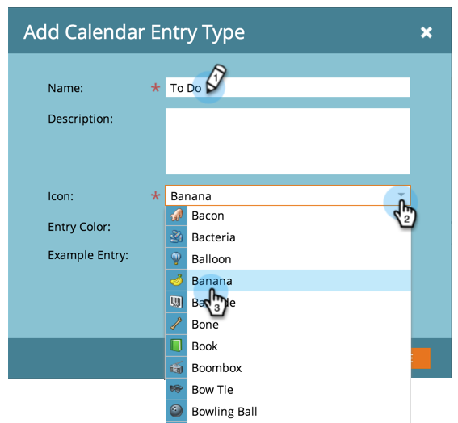

# 建立自定義條目類型{#create-custom-entry-types}

您可以建立自定義條目類型，以便在「程式計畫視圖」中使用。 這可讓您追蹤影響您方案的所有非行銷人員議程項目。

1. 前往&#x200B;**Admin**&#x200B;區段，然後按一下&#x200B;**Tags**。

   

1. 按一下&#x200B;**日曆條目類型**。

   

1. 按一下「**新建**」下拉式清單並選擇「條目類型&#x200B;**」。**

   

1. 命名您的項目並選取圖示。

   

1. 選擇&#x200B;**條目顏色**。

   

1. 按一下&#x200B;**保存**。

   

太好了！ 現在，當您在排程檢視中建立新項目時，此類型將是選項。

>[!NOTE]
>
>您最多可建立100種自訂項目類型。

