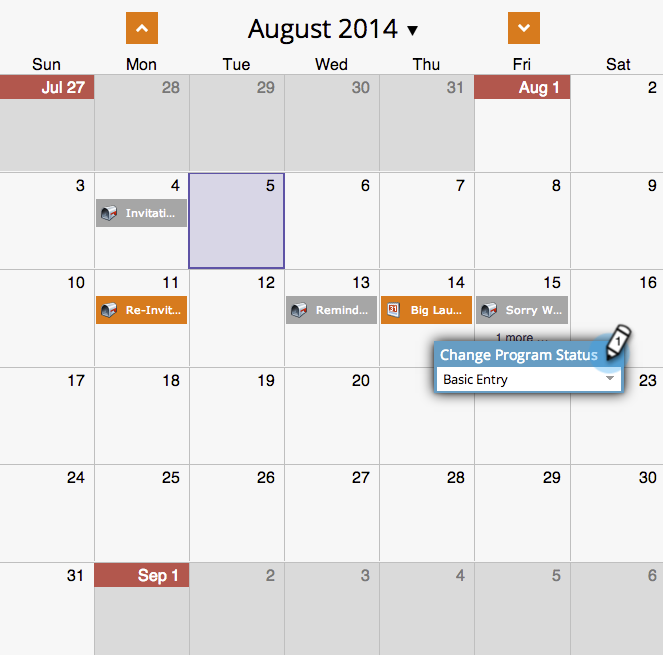

# 在方案排程檢視中建立批次智慧行銷活動 {#creating-a-batch-smart-campaign-in-the-program-schedule-view}

您可以建立新的智慧行銷活動，並 [重新執行現有專案](/help/marketo/product-docs/core-marketo-concepts/programs/program-schedule-view/rerun-a-smart-campaign-in-the-program-schedule-view.md) 從方案排程檢視進入您的方案。

>[!NOTE]
>
>在此檢視中只能建立批次智慧行銷活動。 觸發器行銷活動不受支援。

1. 選取您要執行新智慧行銷活動的日期。

   

1. 為您的專案選擇名稱，這會成為您新的智慧行銷活動。 按下 **輸入/傳回** 金鑰以確認名稱。

   

1. 按一下 **型別** 下拉式清單並選擇 **Smart Campaign**.

   

   >[!NOTE]
   >
   >您也可以從下拉式選單中選取現有的智慧型行銷活動，以執行該行銷活動。

   

1. 選擇您的 [智慧型行銷活動](/help/marketo/product-docs/core-marketo-concepts/smart-campaigns/creating-a-smart-campaign/create-a-new-smart-campaign.md) 規則。

   

1. 您現在會看到此智慧行銷活動，如排程檢視和專案詳細資訊中所確認。

   

這會在您的程式中建立新的智慧型行銷活動執行。
