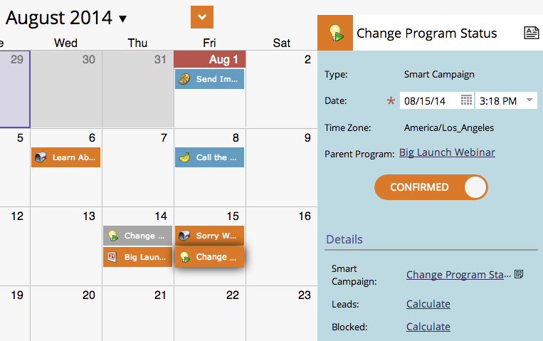

# 在方案計畫視圖{#creating-a-batch-smart-campaign-in-the-program-schedule-view}中建立批智慧型促銷活動

您可以建立新的智慧型促銷活動，並從方案排程檢視中重新執行程式內現有的促銷活動](/help/marketo/product-docs/core-marketo-concepts/programs/program-schedule-view/rerun-a-smart-campaign-in-the-program-schedule-view.md)。[

>[!NOTE]
>
>在此檢視中只能建立批次智慧型促銷活動。 不支援觸發促銷活動。

1. 選擇您希望新智慧型促銷活動執行的日期。

   

1. 為您的參加項目選擇名稱，這將成為您新的智慧型促銷活動。 按鍵確認名稱。****

   

1. 按一下「**類型**」下拉式清單，然後選擇「智慧型促銷活動」**。**

   

   >[!NOTE]
   >
   >您也可以從下拉式清單中選取現有的智慧型促銷活動，以執行它。

   

1. 選擇您的[智慧型促銷活動](/help/marketo/product-docs/core-marketo-concepts/smart-campaigns/creating-a-smart-campaign/create-a-new-smart-campaign.md)規則。

   

1. 您現在會在排程檢視和項目詳細資料中看到此智慧型促銷活動已確認。

   

這將在您的程式中建立新的智慧型促銷活動執行。
