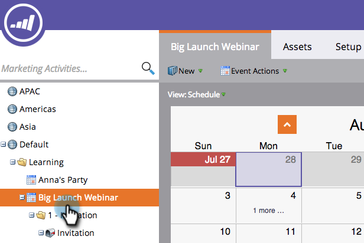

# 在排程視圖中建立新的電子郵件方案 {#creating-a-new-email-program-in-the-schedule-view}

您可以從方案排程檢視內建置電子郵件方案。 方法如下。

1. 前往 **[!UICONTROL Marketing Activities]**。

   

1. 選取您的程式。

   

1. 選取您要執行電子郵件程式的日期。

   

1. 輸入名稱。 選取「**[!UICONTROL Email Program]**」。

   

1. 在專案詳細資訊中，按一下新電子郵件程式的連結。

   

1. [設定您的電子郵件程式](/help/marketo/product-docs/email-marketing/email-programs/creating-an-email-program/create-an-email-program.md){target="_blank"}並按一下&#x200B;**[!UICONTROL Approve Program]**。

   

   除了詳細儀表板，使用[電子郵件程式](/help/marketo/product-docs/email-marketing/email-programs/creating-an-email-program/understanding-email-programs.md){target="_blank"}而非智慧行銷活動的優點在於能夠輕鬆實作[A/B測試](/help/marketo/product-docs/email-marketing/email-programs/email-program-actions/email-test-a-b-test/add-an-a-b-test.md){target="_blank"}。 祝您使用愉快！
