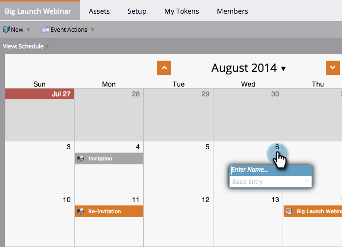

# 在「計畫」視圖中建立新電子郵件程式 {#creating-a-new-email-program-in-the-schedule-view}

您可以從方案排程檢視中建立電子郵件方案。 這是方法。

1. 前往行 **銷活動**。

   

1. 選擇您的方案。

   

1. 選擇您希望電子郵件程式運行的日期。

   

1. 輸入名稱。 選擇 **電子郵件****方案**。

   

1. 在項目詳細資訊中，按一下新電子郵件程式的連結。

   

1. [設定您的電子郵件方案](../../../../product-docs/email-marketing/email-programs/creating-an-email-program/create-an-email-program.md) ，然後按一 **下「核准方案**」。

   

   除了詳細的儀表板外，使用電子郵 [件程式](http://docs.marketo.com/display/docs/email+programs) （而非智慧型促銷活動）的優點，在於能夠輕鬆實作 [A/B測試](../../../../product-docs/email-marketing/email-programs/email-program-actions/email-test-a-b-test/add-an-a-b-test.md)。 享受！

