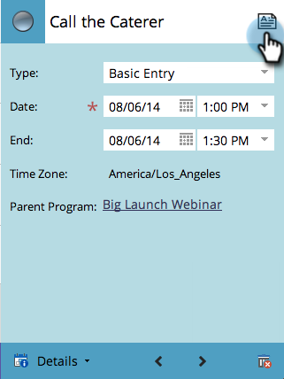

# 在程式計畫視圖{#creating-an-entry-in-the-program-schedule-view}中建立條目

您可以從方案計畫視圖中建立條目以補充現有方案。

## 建立基本條目{#create-a-basic-entry}

1. 前往&#x200B;**行銷活動**。

   

1. 選擇您的方案。 按一下&#x200B;**視圖**&#x200B;下拉式清單。 選擇&#x200B;**計畫**。

   

1. 按一下某天將項目新增至。

   

1. 為條目命名。 按&#x200B;**Enter**&#x200B;確認名稱。

   

1. 選擇新條目的開始和結束日期／時間。

   

1. 按一下說明圖示以新增其他資訊。

   

1. 輸入您的說明，然後按一下&#x200B;**保存**。

   

1. 將滑鼠指標暫留在描述圖示上，以檢視項目描述。

   

## 更改條目類型{#change-entry-type}

1. 從&#x200B;**議程**&#x200B;視圖中選擇一個基本條目。

   

1. 選擇&#x200B;**Type**&#x200B;下拉式清單。 選擇新條目類型。

   >[!NOTE]
   >
   >待辦事項是[自訂項目](/help/marketo/product-docs/core-marketo-concepts/programs/program-schedule-view/create-custom-entry-types.md)。 您可以製作待辦項目和其他自訂項目，以協助追蹤非Marketo議程項目。

   

   酷！ 您應立即看到變更。

   

>[!NOTE]
>
> 您也可以從排程檢視建立[智慧型促銷活動](/help/marketo/product-docs/core-marketo-concepts/programs/program-schedule-view/creating-a-batch-smart-campaign-in-the-program-schedule-view.md)或[電子郵件程式](/help/marketo/product-docs/core-marketo-concepts/programs/program-schedule-view/creating-a-new-email-program-in-the-schedule-view.md)。
