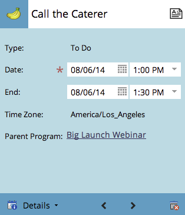

# 在方案排程檢視中建立專案 {#creating-an-entry-in-the-program-schedule-view}

您可以從方案排程檢視中建立專案，以補充現有方案。

## 建立基本專案 {#create-a-basic-entry}

1. 移至&#x200B;**[!UICONTROL 行銷活動]**。

   

1. 選取您的程式。 按一下&#x200B;**[!UICONTROL 檢視]**&#x200B;下拉式清單。 選取&#x200B;**[!UICONTROL 排程]**。

   

1. 按一下要新增專案的日期。

   

1. 為專案命名。 按下&#x200B;**[!UICONTROL Enter]**&#x200B;以確認名稱。

   

1. 選取新專案的開始和結束日期/時間。

   

1. 按一下說明圖示以新增其他資訊。

   

1. 輸入您的描述，然後按一下&#x200B;**[!UICONTROL 儲存]**。

   

1. 將滑鼠指標暫留在說明圖示上，即可檢視專案說明。

   

## 變更專案型別 {#change-entry-type}

1. 從&#x200B;**[!UICONTROL 議程]**&#x200B;檢視中選取基本專案。

   

1. 選取&#x200B;**[!UICONTROL 型別]**&#x200B;下拉式清單。 選擇新的專案型別。

   >[!NOTE]
   >
   >待辦事項是[自訂專案](/help/marketo/product-docs/core-marketo-concepts/programs/program-schedule-view/create-custom-entry-types.md){target="_blank"}。 您可以建立待辦事項和其他自訂專案，以協助追蹤非Marketo議程專案。

   

   酷！ 您應該會立即看到變更。

   

>[!NOTE]
>
> 您也可以從排程檢視建立[智慧型行銷活動](/help/marketo/product-docs/core-marketo-concepts/programs/program-schedule-view/creating-a-batch-smart-campaign-in-the-program-schedule-view.md){target="_blank"}或[電子郵件程式](/help/marketo/product-docs/core-marketo-concepts/programs/program-schedule-view/creating-a-new-email-program-in-the-schedule-view.md){target="_blank"}。
