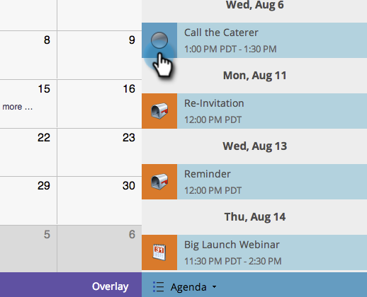

# 在「方案計畫」視圖中建立條目 {#creating-an-entry-in-the-program-schedule-view}

您可以從方案計畫視圖中建立條目以補充現有方案。

## 建立基本項目 {#create-a-basic-entry}

1. 前往行 **銷活動**。

   

1. 選擇您的方案。 按一下 **「檢視** 」下拉式清單。 選擇 **計畫**。

   

1. 按一下某天將項目新增至。

   

1. 為條目命名。 按**輸入**以確認姓名。

   

1. 選擇新條目的開始和結束日期／時間。

   

1. 按一下說明圖示以新增其他資訊。

   

1. 輸入您的說明，然後按一 **下儲存**。

   

1. 將滑鼠指標暫留在描述圖示上，以檢視項目描述。

   

## 更改條目類型 {#change-entry-type}

1. 從「議程」視圖中選擇基 **本條目** 。

   

1. 選擇「 **類型** 」(Type)下拉式清單。 選擇新條目類型。

   >[!NOTE]
   >
   >待辦事項是自訂 [項目](create-custom-entry-types.md)。 您可以製作待辦項目和其他自訂項目，以協助追蹤非Marketo議程項目。

   

   酷！ 您應立即看到變更。

   

>[!NOTE]
>
> 您也可以從排程檢視 [建立智慧型](creating-a-batch-smart-campaign-in-the-program-schedule-view.md)[促銷活動](creating-a-new-email-program-in-the-schedule-view.md) 或電子郵件方案。

