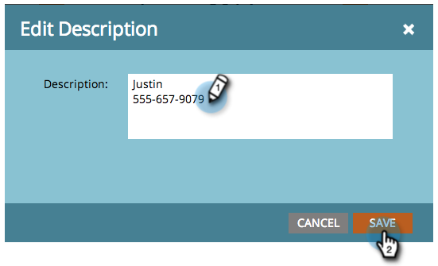
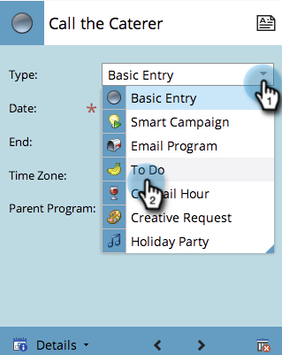

# 在方案計畫視圖中建立條目 {#creating-an-entry-in-the-program-schedule-view}

您可以從方案計畫視圖中建立條目，以補充現有方案。

## 建立基本條目 {#create-a-basic-entry}

1. 前往 **行銷活動**.

   

1. 選取您的方案。 按一下 **檢視** 下拉式清單。 選擇 **排程**.

   

1. 按一下某天將項目新增至。

   

1. 為項目命名。 Press **輸入** 確認名稱。

   

1. 選取新項目的開始和結束日期/時間。

   

1. 按一下說明圖示以新增其他資訊。

   

1. 輸入您的說明，然後按一下 **儲存**.

   

1. 將滑鼠指標暫留在說明圖示上，即可檢視項目說明。

   

## 更改條目類型 {#change-entry-type}

1. 從 **議程** 檢視。

   

1. 選取 **類型** 下拉式清單。 選擇新條目類型。

   >[!NOTE]
   >
   >待辦事項是 [自訂項目](/help/marketo/product-docs/core-marketo-concepts/programs/program-schedule-view/create-custom-entry-types.md). 您可以建立待辦項目和其他自訂項目，以協助追蹤非Marketo議程項目。

   

   酷！ 您應該會立即看到變更。

   

>[!NOTE]
>
> 您也可以建立 [智慧型行銷活動](/help/marketo/product-docs/core-marketo-concepts/programs/program-schedule-view/creating-a-batch-smart-campaign-in-the-program-schedule-view.md) 或 [電子郵件方案](/help/marketo/product-docs/core-marketo-concepts/programs/program-schedule-view/creating-a-new-email-program-in-the-schedule-view.md) 從排程檢視。
