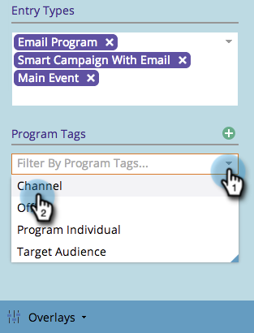

# 在方案排程檢視中建立自訂覆蓋 {#creating-custom-overlays-in-program-schedule-view}

您可以建立自訂覆蓋圖以檢視與您需求相關的項目。

1. 按一下 **議程** 下拉式清單。

   

1. 選擇 **覆蓋**.

   

1. 選取您要在覆蓋圖中顯示的登入類型。

   

1. 您也可以依 [方案標籤](/help/marketo/product-docs/core-marketo-concepts/programs/working-with-programs/understanding-tags/use-tags-in-a-program.md).

   

   太棒了。 現在您的覆蓋只會顯示您已定義的項目。

   
