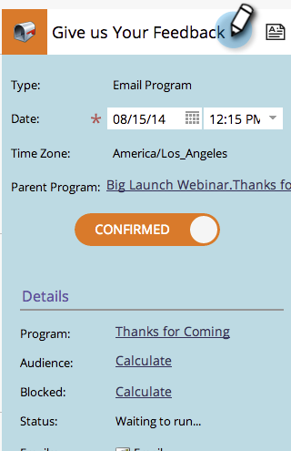
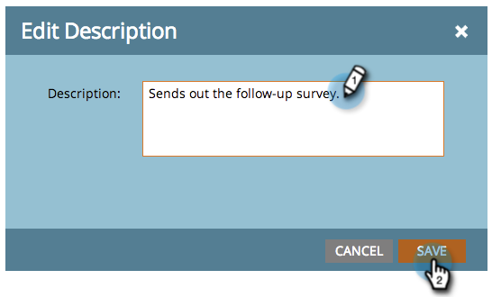

# 在方案排程視圖中編輯條目 {#editing-entries-in-the-program-schedule-view}

您可以在排程檢視中編輯方案的不同元素。

## 編輯專案名稱 {#edit-an-entrys-name}

1. 選取您要編輯的專案。

   

1. 輸入新名稱，然後按鍵盤上的&#x200B;**[!UICONTROL Enter/Return]**&#x200B;以確認變更。

   

>[!CAUTION]
>
>這只會變更排程檢視中的顯示名稱。 程式中的資產名稱將維持不變。

## 編輯專案說明 {#edit-an-entrys-description}

1. 按一下說明圖示。

   

1. 編輯您的說明。 按一下「**[!UICONTROL Save]**」。

   

1. 已更新說明。

   

## 編輯專案的日期 {#edit-an-entrys-date}

1. 選取新日期。

   

已更新您的專案日期。

>[!NOTE]
>
> 已執行的Smart Campaign和電子郵件程式專案無法移至過去。
