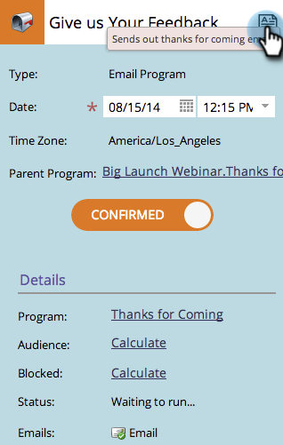

# 編輯程式計畫視圖{#editing-entries-in-the-program-schedule-view}中的條目

您可以在排程檢視中編輯程式的不同元素。

## 編輯條目的名稱{#edit-an-entrys-name}

1. 選擇要編輯的條目。

   

1. 鍵入新名稱，然後按鍵盤上的&#x200B;**Enter/Return**&#x200B;確認更改。

   

>[!CAUTION]
>
>這只會變更排程檢視中的顯示名稱。 方案中資產的名稱將維持不變。

## 編輯條目的說明{#edit-an-entrys-description}

1. 按一下說明圖示。

   

1. 編輯您的說明。 按一下&#x200B;**保存**。

   

1. 太好了！ 您的描述現在已變更。

   

## 編輯條目的日期{#edit-an-entrys-date}

1. 選擇新日期。

   

你真棒！ 現在您的參加日期已移至新日期。

>[!NOTE]
>
> 已執行的智慧型促銷活動和電子郵件程式項目無法移至過去。
