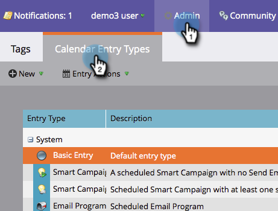

# 隱藏和取消隱藏自訂項目類型 {#hiding-and-unhiding-custom-entry-types}

自訂項目類型可隱藏在「管理」區段中。 隱藏後，登入類型將不再顯示為選項。

## 隱藏自訂項目類型 {#hide-a-custom-entry-type}

1. 前往 **管理** 區段，按一下 **日曆條目** **類型**.

   

1. 以滑鼠右鍵按一下自訂項目，然後按一下 **隱藏**.

   

   太棒了。 此項目類型將不再可用。

## 取消隱藏自定義條目類型 {#unhide-a-custom-entry-type}

如果您想要取消隱藏自訂項目類型，也很容易。

1. 以滑鼠右鍵按一下您的項目並選取 **取消隱藏**.

   

   太！ 您的自訂項目類型現在已取消隱藏。

   
