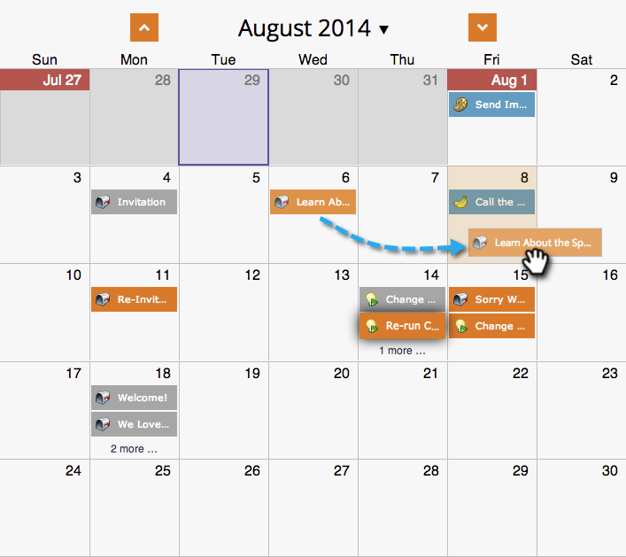

# 在方案排程檢視中移動專案 {#moving-entries-in-the-program-schedule-view}

在排程檢視中移動專案會自動重新排程。

>[!NOTE]
>
>無法移動已執行的智慧型行銷活動、參與方案或郵件傳送。

1. 選取您的專案。 將其拖放至其他日期。

   

1. 然後我們的資料擷取器會取消核准、變更日期並重新核准資產。 他很酷。

   

   您的專案現在將會重新排程。

   
