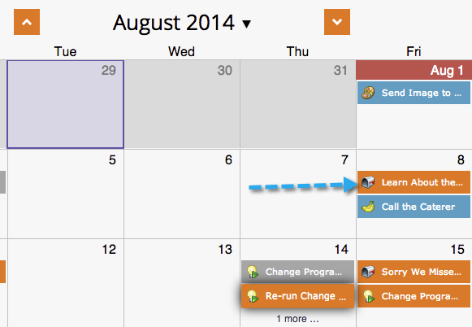

# 在程式計畫視圖中移動條目 {#moving-entries-in-the-program-schedule-view}

移動計畫視圖中的條目將自動重新計畫它們。

>[!NOTE]
>
>已執行的智慧型宣傳、參與計畫或郵件轟炸無法移動。

1. 選擇您的項目。 將它拖放至不同的日期。

   

1. 然後，我們的資料擷取器會取消核准、變更日期並重新核准資產。 他真酷。

   

   沃夫！ 現在將重新排程您的參加項目。

   

