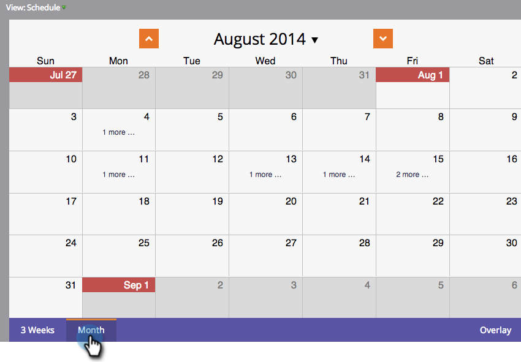

# 導航程式計畫視圖 {#navigating-the-program-schedule-view}

以下是可協助您導覽方案排程檢視的基本知識。

## 查找計畫視圖 {#find-the-schedule-view}

1. 前往 **行銷活動**.

   

1. 選取您的方案。 按一下 **檢視** 下拉式清單。 選擇 **排程**.

   

   現在，您將查看計畫的計畫視圖。

   

>[!NOTE]
>
>方案排程檢視是自黏的。 設定後，所有程式都會預設為排程檢視。

## 在條目之間切換 {#switching-between-entries}

1. 在項目詳細資訊中，按一下箭頭以移至下一個計畫的項目。

   

   挺酷的吧？

   

## 檢視內容功能表 {#view-context-menu}

1. 按一下右鍵任何程式以編輯程式、智慧清單、設定、我的令牌或成員。

   

## 在模式之間更改 {#changing-between-modes}

1. 按一下 **3週** 或 **月** 會變更顯示的日期。

   

## 全螢幕檢視 {#full-screen-view}

1. 您可以按一下右上角的螢幕圖示，以全螢幕模式檢視您的方案排程。

   

太棒了！ 既然您知道如何檢視您的程式，讓我們了解其他酷炫功能。

>[!MORELIKETHIS]
>
>[在方案計畫視圖中建立條目](/help/marketo/product-docs/core-marketo-concepts/programs/program-schedule-view/creating-an-entry-in-the-program-schedule-view.md)
