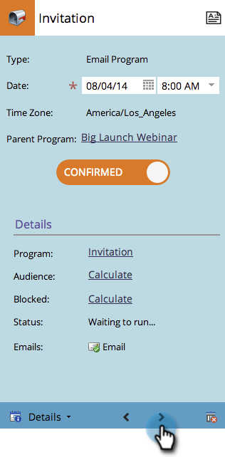

# 瀏覽方案排程檢視 {#navigating-the-program-schedule-view}

以下為協助您瀏覽方案排程檢視的基本知識。

## 尋找排程檢視 {#find-the-schedule-view}

1. 前往 **行銷活動**.

   

1. 選取您的程式。 按一下 **檢視** 下拉式清單。 選取 **排程**.

   

   現在您將檢視方案的排程檢視。

   

>[!NOTE]
>
>方案排程檢視為粘性。 設定後，所有程式都將預設為排程檢視。

## 在專案之間切換 {#switching-between-entries}

1. 在專案詳細資訊中，按一下箭頭，移至下一個排定的專案。

   

   很酷吧？

   

## 檢視內容功能表 {#view-context-menu}

1. 以滑鼠右鍵按一下任何程式，即可編輯程式、智慧清單、設定、我的代號或成員。

   

## 在模式之間變更 {#changing-between-modes}

1. 按一下 **3週** 或 **月** 將會變更顯示畫面上的可見日期。

   

## 全熒幕檢視 {#full-screen-view}

1. 您可以按一下右上角的畫面圖示，以全熒幕模式檢視您的方案排程。

   

太棒了！ 現在您已經知道如何檢視程式，讓我們來瞭解它還可以執行的其他有趣操作。

>[!MORELIKETHIS]
>
>[在方案排程檢視中建立專案](/help/marketo/product-docs/core-marketo-concepts/programs/program-schedule-view/creating-an-entry-in-the-program-schedule-view.md)
