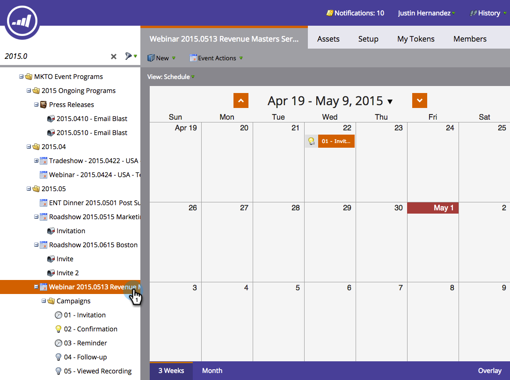
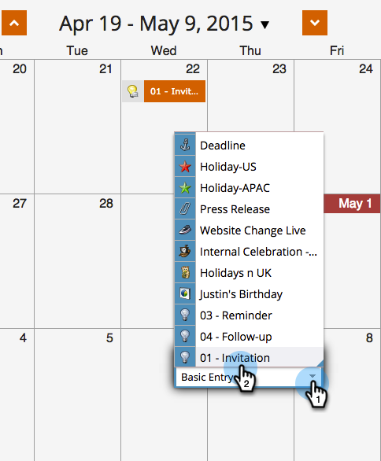

# 在計畫計畫視圖{#rerun-a-smart-campaign-in-the-program-schedule-view}中重新運行智慧促銷活動

您可以直接從方案排程檢視，輕鬆建立現有智慧型促銷活動的新執行。

1. 前往&#x200B;**行銷活動**。

   

1. 選取包含智慧型促銷活動的方案。

   

1. 在排程檢視中，按一下您要設定新執行的日期，並為您的項目提供容易理解的名稱（例如「第二次邀請」）。

   

1. 選擇參加項目類型功能表下拉式清單，然後選擇要重新執行的智慧型促銷活動。

   

   >[!TIP]
   >
   >您也可以從[程式焦點](/help/marketo/product-docs/core-marketo-concepts/marketing-calendar/understanding-the-calendar/understand-enable-program-focus.md)執行此操作。

砰！ 就這樣，您已為該智慧型促銷活動排程另一個執行。 如果智慧型促銷活動包含傳送電子郵件步驟，您也會看到這些步驟！
