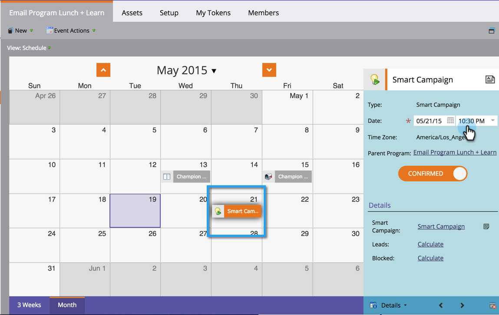

# 在方案排程檢視中重新排程批次智慧行銷活動 {#reschedule-a-batch-smart-campaign-in-the-program-schedule-view}

想要重新排程批次智慧行銷活動執行嗎？ 將它們拖放到方案排程檢視中的未來中。

1. 選取您要重新排程的智慧行銷活動。

   

1. 拖放至您要執行行銷活動的新日期。

1. 太棒了！ 智慧型行銷活動已重新排程。 時間也可以從 **日期** 專案詳細資訊中的下拉式清單。

   

>[!MORELIKETHIS]
>
>[從排程檢視重新排程整個程式](/help/marketo/product-docs/core-marketo-concepts/programs/program-schedule-view/rescheduling-an-entire-program-from-the-schedule-view.md)
