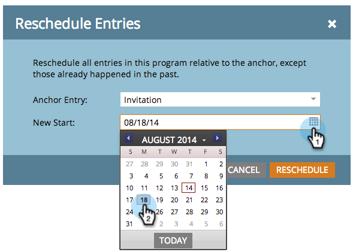

# 從排程檢視重新排程整個程式 {#rescheduling-an-entire-program-from-the-schedule-view}

當您複製包含日期的方案或事件時，您可能會想要一次重新排程所有日期。 方法如下。

1. 選取要重新排程的方案。

   

1. 選取「事件動作」下拉式清單。 選擇 **重新排程專案**.

   

1. 選取錨點專案。 根據此移動，所有其他專案將隨之移動。

   

1. 選擇新的開始日期。

   

1. 按一下 **重新排程**.

   

1. 之後，我們的資料擷取器會以正確的日期取消核准、重新排程並重新核准您的所有資產！

   

>[!NOTE]
>
>已執行的資產將不會移動。

所有專案現在都已重新排程。 視需要調整任何特定日期。

