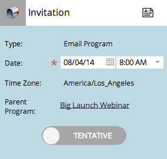

# 瞭解暫定/已確認的日期 {#understanding-tentative-confirmed-dates}

智慧型行銷活動和電子郵件程式具有強大的功能，可標籤為 **暫定** 或 **已確認**. 以下是運作方式。

## 暫定 {#tentative}

暫定日期表示意向。 請將此視為 _鉛筆_ 行事曆中的某些內容。 暫定專案將不會執行 — 它們只是預留位置。

>[!NOTE]
>
>只有批次智慧型行銷活動和電子郵件方案可以暫定。

## 確認專案 {#confirming-entries}

這就像核准資產一樣，因此專案必須先完全設定，您才能確認它們。 一旦所有的鴨子都排成一列後，您就可以將試用的標籤滑向右邊，以確認輸入。

>[!NOTE]
>
>為什麼是狗？ 他是獵頭。 他正在擷取您的資料。

## 已確認 {#confirmed}

已確認的專案一定會執行。 它們有規則、已核准的資產以及已確認的日期和時間。

## 已完成  {#finished}

已完成的專案已執行。 它們只能是過去（很顯然）。 專案執行完畢後，即 **已完成**，則無法移動或將其設定為暫定。 （不會改變現實和干擾時間流連續體。）

這些狀態是強大的工具。 當您複製方案時，所有智慧行銷活動和電子郵件方案日期都是暫定日期。 這些設定都可從排程檢視確認。 很酷，對吧？
