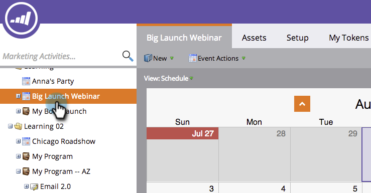

# 使用全域覆蓋 {#using-a-global-overlay}

方案排程檢視中的全域覆蓋可讓您檢視與其他已排程資產相關的方案。

>[!PREREQUISITES]
>
>您必須擁有 [行銷行事曆授權](/help/marketo/product-docs/core-marketo-concepts/marketing-calendar/understanding-the-calendar/issue-revoke-a-marketing-calendar-license.md) 以使用此功能。

## 使用全域覆蓋 {#use-the-global-overlay}

1. 選取您的程式。

   

1. 選取 **覆蓋** 在右下角。

   

1. 實心區塊代表該日期的專案。 按一下以檢視詳細資料。

   

   覆蓋專案的專案詳細資料將為唯讀。 按一下父方案以進行變更。

   

## 使用儲存的篩選器作為覆蓋 {#use-a-saved-filter-as-an-overlay}

如果您已 [已在行銷行事曆中儲存篩選器](/help/marketo/product-docs/core-marketo-concepts/marketing-calendar/working-with-the-calendar/saving-a-filter-definition-in-the-marketing-calendar.md)，您可在方案排程檢視中將其當作覆蓋圖。

1. 按一下 **覆蓋** 下拉式清單，然後選取您的篩選器定義。

   

   太簡單了！ 現在您會看到由已儲存並選取的篩選器所定義的覆蓋。

   

   >[!MORELIKETHIS]
   >
   >[在方案排程檢視中建立自訂覆蓋圖](/help/marketo/product-docs/core-marketo-concepts/programs/program-schedule-view/creating-custom-overlays-in-program-schedule-view.md)
