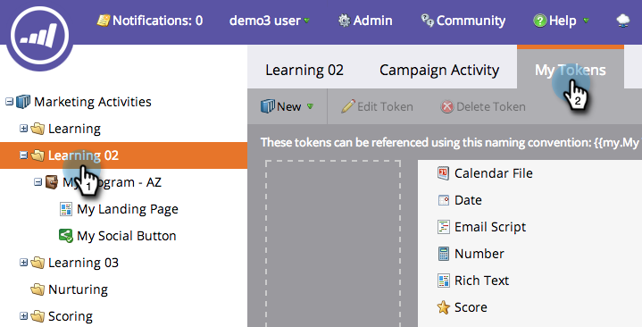

# 管理我的Token {#managing-my-tokens}

使用代號可簡化您在Marketo中的工作。 您可以使用 [我的Token](/help/marketo/product-docs/core-marketo-concepts/programs/tokens/understanding-my-tokens-in-a-program.md) （自訂Token）的流量、Webhook、電子郵件和登入頁面。 以下說明如何製作範本。

>[!TIP]
>
>進一步瞭解中已有哪些代號 [Token概述](/help/marketo/product-docs/demand-generation/landing-pages/personalizing-landing-pages/tokens-overview.md).

## 建立我的Token {#create-a-my-token}

1. 前往 **行銷活動**.

   

1. 選取方案或行銷活動資料夾。 按一下 **我的Token**.

   

1. 選取 **我的Token** 型別。 將其拖放到畫布上。

   

1. 輸入唯一的名稱。 輸入權杖的相關值。

   

1. 按一下 **儲存**.

   

   耶！ 您製作了「我的Token」。

   

## 編輯我的Token {#edit-a-my-token}

1. 按兩下 **我的Token** 並進行變更。 按一下 **儲存**.

   

## 刪除我的Token {#delete-a-my-token}

>[!CAUTION]
>
>刪除「我的Token」時，請確定您沒有在任何資產中參照該專案。 若刪除，參考到的任何位置都會顯示空白。

1. 用滑鼠右鍵按一下 **我的Token**. 選取 **刪除Token**.

   

1. 按一下 **刪除**.

   

   >[!MORELIKETHIS]
   >
   >* [Token概述](/help/marketo/product-docs/demand-generation/landing-pages/personalizing-landing-pages/tokens-overview.md)
   >* [瞭解方案中的我的Token](/help/marketo/product-docs/core-marketo-concepts/programs/tokens/understanding-my-tokens-in-a-program.md)
   >* [在我的Token中使用URL](/help/marketo/product-docs/email-marketing/general/using-tokens/using-urls-in-my-tokens.md)
