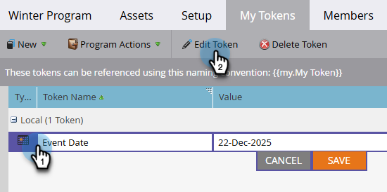

# 管理我的權杖 {#managing-my-tokens}

使用代號可簡化您在Marketo Engage中的工作。 您可以在流程步驟、Webhook、電子郵件和登入頁面中使用[我的權杖](/help/marketo/product-docs/core-marketo-concepts/programs/tokens/understanding-my-tokens-in-a-program.md){target="_blank"} （自訂權杖）。 以下說明如何製作範本。

>[!TIP]
>
>深入瞭解[代號概觀](/help/marketo/product-docs/demand-generation/landing-pages/personalizing-landing-pages/tokens-overview.md){target="_blank"}中已有哪些代號。

## 建立本機或全域My Token {#create-a-my-token}

>[!BEGINTABS]

>[!TAB 本機My Token]

1. 在&#x200B;**[!UICONTROL Marketing Activities]**&#x200B;中，選取所需的方案或行銷活動資料夾，然後按一下其&#x200B;**[!UICONTROL My Tokens]**&#x200B;索引標籤。

   

1. 將所需的「我的Token」拖曳至畫布上。

   

1. 輸入唯一名稱並輸入相關值。

   

1. 按一下「**[!UICONTROL Save]**」。

   

>[!TAB 全域我的Token]

>[!NOTE]
>
>需要管理員許可權。

1. 移至&#x200B;**[!UICONTROL Admin]**&#x200B;區域並選取&#x200B;**[!UICONTROL My Tokens]**。

   

1. 將所需的「我的Token」拖曳至畫布上。

   

1. 輸入唯一名稱並輸入相關值。

   

1. 按一下「**[!UICONTROL Save]**」。

   

>[!ENDTABS]

## 編輯我的Token {#edit-a-my-token}

1. 選取您要編輯的Token，然後按一下&#x200B;**[!UICONTROL Edit Token]**。

   

1. 進行您想要的編輯。 完成時，按一下&#x200B;**[!UICONTROL Save]**。

   

## 刪除我的Token {#delete-a-my-token}

>[!CAUTION]
>
>刪除「我的Token」時，請確定目前沒有任何資產參照該專案。 若刪除，參考到的任何位置都會顯示空白。

1. 選取您要刪除的權杖，然後按一下&#x200B;**[!UICONTROL Delete Token]**。

   

1. 按一下「**[!UICONTROL Delete]**」。

   

   >[!MORELIKETHIS]
   >
   >* [Token概述](/help/marketo/product-docs/demand-generation/landing-pages/personalizing-landing-pages/tokens-overview.md){target="_blank"}
   >* [瞭解程式中的我的Token](/help/marketo/product-docs/core-marketo-concepts/programs/tokens/understanding-my-tokens-in-a-program.md){target="_blank"}
   >* [在我的Token中使用URL](/help/marketo/product-docs/email-marketing/general/using-tokens/using-urls-in-my-tokens.md){target="_blank"}
