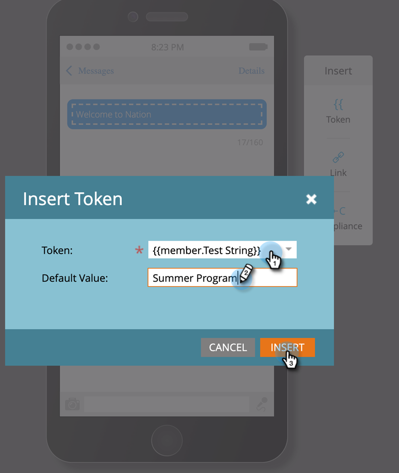
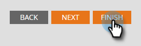

# 程式成員自訂欄位權杖 {#program-member-custom-field-tokens}

## 程式成員自訂欄位的權杖支援 {#token-support-for-program-member-custom-fields}

在「方案成員自訂欄位」功能的背面，Token架構中的「方案成員自訂欄位」支援已擴展。

PMCF代號將受代號系列成員網域支援。

成員Token用於「方案成員」範圍內的欄位。 截至目前狀態，成員Token也可用來插入整合式服務合作夥伴的唯一值。 `{{member.webinar url}}` 代號會自動解析服務提供者產生的個人唯一確認URL。 {{member.registration code}} 解析至服務提供者提供的註冊代碼。

>[!NOTE]
>
>* 方案成員自訂欄位只能在方案的內容中使用。
>* 方案成員自訂欄位權杖無法用於：電子郵件前置詞、等待步驟中的日期權杖或代碼片段。
>* 成員Token不支援程式成員狀態。

## 在Assets中使用方案成員自訂欄位權杖 {#using-program-member-custom-field-tokens-in-assets}

您可以將方案成員自訂欄位權杖插入電子郵件、登陸頁面、簡訊、推播通知和Webhook。

**電子郵件**

1. 選取所需的電子郵件並按一下 **編輯草稿**.

   

1. 按一下「插入Token」圖示。

   

1. 尋找並選取所需的程式成員自訂欄位權杖，輸入預設值，然後按一下 **插入**.

   

1. 按一下 **儲存**.

   

>[!NOTE]
>
>別忘了核准您的電子郵件。

**登陸頁面**

1. 選取您的登陸頁面，然後按一下 **編輯草稿**.

   

   >[!NOTE]
   >
   >登入頁面設計工具會在新視窗中開啟。

1. 連按兩下您想要新增權杖的RTF文字方塊。

   

1. 按一下您要標籤的位置，然後按一下「插入標籤」圖示。

   

1. 尋找並選取所需的代號。

   

1. 輸入預設值並按一下 **插入**.

   

1. 按一下 **儲存**.

   

**簡訊**

1. 選取所需的SMS並按一下 **編輯草稿**.

   

1. 按一下 **`{{ Token`** 按鈕。

   

1. 尋找並選取所需的程式成員自訂欄位權杖。 輸入預設值，然後按一下「插入」。

   

1. 按一下簡訊動作下拉式清單，然後選取 **核准並關閉**.

   

**推播通知**

1. 選取所需的推播通知並按一下 **編輯草稿**.

   

1. 按一下 **推播通知**.

   

1. 在編輯器中按一下訊息，然後按一下 `{{` 按鈕以取得Token選擇器。

   

1. 尋找並選取所需的程式成員自訂欄位權杖。 輸入預設值，然後按一下 **插入**.

   

1. 按一下 **完成** 儲存並結束(或 **下一個** ，請先檢閱)。

   

>[!NOTE]
>
>如果方案的成員的「方案成員自訂欄位」沒有值，則代號將被預設值取代（如果已提供）。

## 在行銷活動中使用方案成員自訂欄位代號 {#using-program-member-custom-field-tokens-in-campaigns}

程式成員自訂欄位權杖可以用在：

* 建立任務
* 在Microsoft中建立任務
* 有趣的時刻
* 變更資料值流程動作
* Webhook
