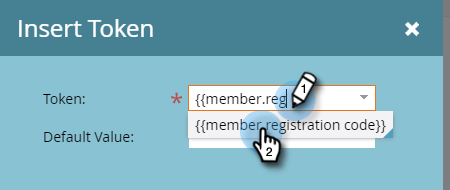

# 程式成員自定義欄位令牌 {#program-member-custom-field-tokens}

## 方案成員自定義欄位的令牌支援 {#token-support-for-program-member-custom-fields}

在方案成員自定義欄位功能的背面，正在擴展對令牌框架中方案成員自定義欄位的支援。

PMCF代號將支援在代號系列的成員網域下。

成員令牌用於方案成員範圍內的欄位。 自當前狀態起，成員令牌還用於插入來自整合服務合作夥伴的唯一值。 `{{member.webinar url}}` token會自動解析服務提供者產生之人員的唯一確認URL。 {{member.registration code}} 解析到服務提供商提供的註冊代碼。

>[!NOTE]
>
>* 方案成員自定義欄位只能在方案的上下文中使用。
>* 程式成員自定義欄位令牌不能用於：電子郵件預先標題、等待步驟中的日期代號或片段。
>* 成員令牌不支援程式成員狀態。

## 在資產中使用方案成員自訂欄位代號 {#using-program-member-custom-field-tokens-in-assets}

您可以將方案成員自訂欄位Token插入電子郵件、登陸頁面、簡訊、推播通知和Webhook中。

**電子郵件**

1. 選取所需的電子郵件，然後按一下 **編輯草稿**.

   

1. 按一下「插入代號」圖示。

   

1. 查找並選擇所需的程式成員自定義欄位標籤，輸入預設值，然後按一下 **插入**.

   

1. 按一下 **儲存**.

   

>[!NOTE]
>
>別忘了核准您的電子郵件。

**登錄頁面**

1. 選取您的登錄頁面，然後按一下 **編輯草稿**.

   

   >[!NOTE]
   >
   >登錄頁面設計器會在新視窗中開啟。

1. 連按兩下您要新增代號的RTF方塊。

   

1. 按一下您要讓Token成為的位置，然後按一下「插入Token」圖示。

   

1. 尋找並選取所需的代號。

   

1. 輸入預設值，然後按一下 **插入**.

   

1. 按一下 **儲存**.

   

**簡訊**

1. 選取所需的簡訊，然後按一下 **編輯草稿**.

   

1. 按一下 **`{{ Token`** 按鈕。

   

1. 查找並選擇所需的程式成員自定義欄位標籤。 輸入預設值，然後按一下「插入」。

   

1. 按一下「簡訊動作」下拉式清單，然後選取 **核准並關閉**.

   

**推播通知**

1. 選取所需的推播通知，然後按一下 **編輯草稿**.

   

1. 按一下 **推播通知**.

   

1. 按一下編輯器中的訊息，然後按一下 `{{` 按鈕來取得Token選取器。

   

1. 查找並選擇所需的程式成員自定義欄位標籤。 輸入預設值，然後按一下 **插入**.

   

1. 按一下 **完成** 儲存並結束(或 **下一個** 先檢閱)。

   

>[!NOTE]
>
>如果程式成員的程式成員自定義欄位沒有值，則如果已提供該令牌，則該令牌將替換為預設值。

## 在促銷活動中使用方案成員自訂欄位代號 {#using-program-member-custom-field-tokens-in-campaigns}

程式成員自定義欄位令牌可用於：

* 建立任務
* 在Microsoft中建立任務
* 有趣的時刻
* 變更資料值流動動作
* Webhook
