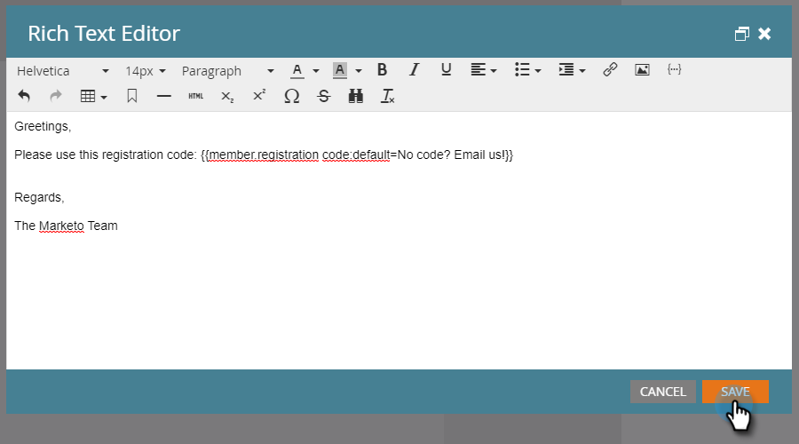

# 方案成員自定義欄位標籤{#program-member-custom-field-tokens}

## 方案成員自訂欄位{#token-support-for-program-member-custom-fields}的Token支援

在「方案會員自訂欄位」功能的背面，Token架構中對「方案會員自訂欄位」的支援正在擴充。

PMCF Token將在Token系列的成員網域下受支援。

「會員代號」用於「方案會員」範圍內的欄位。 自目前狀態起，會員Token也可用來插入整合服務合作夥伴的唯一值。 `{{member.webinar url}}` Token會自動解析服務提供者產生的個人唯一確認URL。{{member.registration code}}會解析為服務供應商提供的註冊代碼。

>[!NOTE]
>
>* 方案成員自定義欄位只能用於方案的上下文。
>* 方案成員自訂欄位Token無法用於：電子郵件指令碼、電子郵件預先標題、等待步驟中的日期標籤或程式碼片段。
>* 「會員代號」不支援「方案會員狀態」。

## 在資產{#using-program-member-custom-field-tokens-in-assets}中使用方案成員自訂欄位Token

您可以將「方案會員自訂欄位Token」插入電子郵件、著陸頁面、簡訊、推播通知和網頁勾點。

**電子郵件**

1. 選擇所需的電子郵件，然後按一下「編輯草稿」。****

   

1. 按一下「插入Token」圖示。

   

1. 查找並選擇所需的程式成員自定義欄位標籤，輸入預設值，然後按一下&#x200B;**插入**。

   

1. 按一下&#x200B;**保存**。

   

>[!NOTE]
>
>不要忘記核准您的電子郵件。

**著陸頁面**

1. 選擇您的著陸頁面，然後按一下「編輯草稿&#x200B;**」。**

   

   >[!NOTE]
   >
   >著陸頁面設計工具會在新視窗中開啟。

1. 連按兩下您要新增Token的Rich Text方塊。

   

1. 按一下您要將Token放在的位置，然後按一下「插入Token」圖示。

   

1. 尋找並選取所需的Token。

   

1. 輸入預設值，然後按一下&#x200B;**插入**。

   

1. 按一下&#x200B;**保存**。

   

**簡訊**

1. 選擇所需的SMS，然後按一下「編輯草稿」。****

   

1. 按一下&#x200B;**`{{ Token`**&#x200B;按鈕。

   

1. 尋找並選取所需的方案會員自訂欄位Token。 輸入預設值，然後按一下「插入」。

   

1. 按一下「SMS動作」下拉式清單，然後選取「核准並關閉」**。**

   

**推播通知**

1. 選取所要的推播通知，然後按一下「編輯草稿」。****

   

1. 按一下「推播通知」。****

   

1. 按一下編輯器中的訊息，然後按一下`{{`按鈕以取得Token選擇器。

   

1. 尋找並選取所需的方案會員自訂欄位Token。 輸入預設值，然後按一下&#x200B;**插入**。

   

1. 按一下&#x200B;**完成**&#x200B;以保存並退出（或按一下&#x200B;**下一步**&#x200B;以首先查看）。

   

>[!NOTE]
>
>如果方案會員的「方案會員自訂欄位」沒有值，則Token會以預設值取代（如果已提供）。

## 在促銷活動中使用方案成員自訂欄位Token {#using-program-member-custom-field-tokens-in-campaigns}

方案成員自訂欄位Token可用於：

* 建立任務
* 在Microsoft中建立任務
* 有趣的時刻
* 更改資料值流動操作
* Webhook
