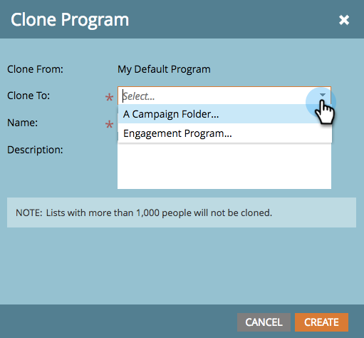

# 克隆程式{#clone-a-program}

快速輕鬆地複製整個程式及其所有資產，而不需手動重建所有項目。

>[!PREREQUISITES]
>
>在深入探討之前，請先瞭解[避免複製資產損毀的最佳實務](https://nation.marketo.com/t5/Knowledgebase/Avoiding-Corruption-in-Cloned-Assets/ta-p/249729)。

1. 查找並選擇要克隆的程式，然後在&#x200B;**Program Actions**&#x200B;下按一下&#x200B;**Clone**。

   

1. 選擇要將程式克隆到的位置。

   >[!NOTE]
   >
   >程式可以克隆到[campaign](/help/marketo/product-docs/core-marketo-concepts/miscellaneous/create-new-campaign-folder.md) [資料夾](/help/marketo/product-docs/core-marketo-concepts/miscellaneous/create-new-campaign-folder.md)或[workspaces](/help/marketo/product-docs/administration/workspaces-and-person-partitions/create-a-new-workspace.md)中。 請確定您共用所有基礎相依資產（電子郵件、程式碼片段、登陸頁面範本等） 在複製之前使用目標工作區。

   

   >[!NOTE]
   >
   >請參閱上述螢幕擷取中的該NOTE? 這表示，如果您複製一個包含1000名或更多人的程式，清單本身會被複製，但是會是空的。 如果克隆的程式包含999人或以下的清單，則該清單及其所有成員將顯示在克隆的程式中。

1. 輸入名稱。

   

1. 選擇要將程式克隆到的資料夾。

   

1. 新增可選說明，然後按一下「建立」。 ****&#x200B;看看您能以多快的速度建立新程式，讓其所有資產都準備就緒！

   

   >[!TIP]
   >
   >使用此技巧和Token，讓您輕鬆建立新程式。

   >[!CAUTION]
   >
   >期間成本不會轉移，因此，如果原始程式中已設定期間成本，請務必將其新增至您的復製程式。
