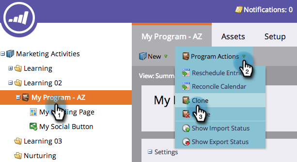

# 原地複製方案 {#clone-a-program}

複製整個計畫及其所有資產，而非手動重建所有內容。

1. 尋找並選取您要複製的程式。 在&#x200B;**[!UICONTROL Program Actions]**&#x200B;下拉式清單中，按一下&#x200B;**[!UICONTROL Clone]**。

   

1. 選取您要將程式複製到的位置。

   >[!NOTE]
   >
   >程式可以複製至[行銷活動](/help/marketo/product-docs/core-marketo-concepts/miscellaneous/create-new-campaign-folder.md) [資料夾](/help/marketo/product-docs/core-marketo-concepts/miscellaneous/create-new-campaign-folder.md)或[工作區](/help/marketo/product-docs/administration/workspaces-and-person-partitions/create-a-new-workspace.md)。 確保所有基礎相依資產（電子郵件、代碼片段、登入頁面範本等） 會在複製前與目的地工作區共用。

   

   >[!NOTE]
   >
   >看到上面的熒幕擷圖中的[!UICONTROL NOTE]了嗎？ 這表示如果您複製清單中具有1000人或更多人員的程式，清單本身將會被複製，但會是空的。 如果您複製某個程式，而該程式的清單包含999名或更少人員，則該清單及其所有成員都會顯示在複製的程式中。

1. 輸入&#x200B;**[!UICONTROL Name]**。

   

1. 選擇目的地資料夾。

   

1. 新增選擇性說明，然後按一下&#x200B;**[!UICONTROL Create]**。

   

   >[!TIP]
   >
   >將此技巧與權杖搭配使用，可讓您更快速地建立新計畫。

   >[!CAUTION]
   >
   >期間成本不會轉移，因此，請確保已新增至複製方案（如果已在原始方案中設定）。
