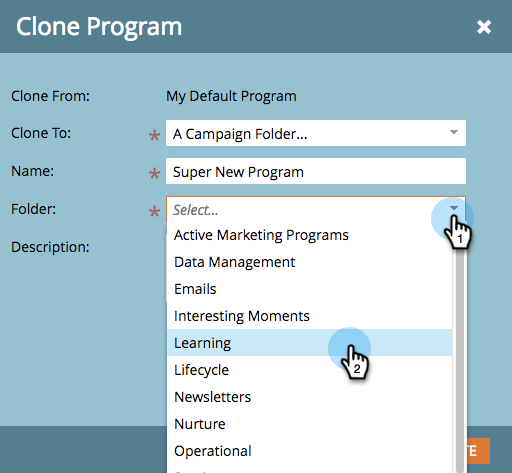

# 復製程式 {#clone-a-program}

快速輕鬆地複製整個計畫及其所有資產，而不是手動重建所有內容。

1. 尋找並選取您要複製的程式，然後在 **程式動作** 按一下 **原地複製**.

   

1. 選取您要將程式複製到的位置。

   >[!NOTE]
   >
   >程式可克隆至 [行銷活動](/help/marketo/product-docs/core-marketo-concepts/miscellaneous/create-new-campaign-folder.md) [資料夾](/help/marketo/product-docs/core-marketo-concepts/miscellaneous/create-new-campaign-folder.md) 或 [工作區](/help/marketo/product-docs/administration/workspaces-and-person-partitions/create-a-new-workspace.md). 請務必共用所有基礎相依資產（電子郵件、代碼片段、登入頁面範本等） 與目的地工作區進行複製前的作業。

   

   >[!NOTE]
   >
   >請參閱上方熒幕擷圖中的注意事項嗎？ 這表示如果您複製清單中具有1000或更多人員的程式，清單本身將會被複製，但會是空的。 如果您複製某個程式，其清單包含999名或更少人員，則該清單及其所有成員將顯示在複製的程式中。

1. 輸入名稱。

   

1. 選擇您要復製程式的資料夾。

   

1. 新增選擇性說明，然後按一下 **建立**. 看看您能以多快的速度建立新計畫，讓所有資產都準備就緒！

   

   >[!TIP]
   >
   >使用此技巧和代號，使建立新程式更容易。

   >[!CAUTION]
   >
   >期間成本不會轉移，因此，如果您在原始程式中設定了期間成本，請務必將其新增到複製的程式中。
