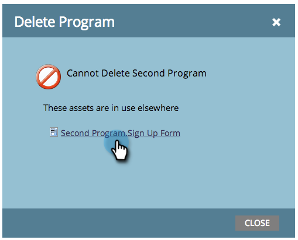

# 刪除程式{#delete-a-program}

您可以封存程式，但有時候您只想永久移除它。 這是方法。

1. 選擇要刪除的程式。

1. 按一下&#x200B;**Program Actions**。 按一下&#x200B;**Delete**。

   

1. 選擇「全部刪除」選項。 查看刪除程式的副作用，然後按一下&#x200B;**Delete**&#x200B;確認。

>[!TIP]
>
>**歸檔** 程式會保留程式資料，但會使程式無法正常運行。選擇該選項，然後按一下&#x200B;**Next**&#x200B;查看有關存檔的詳細資訊。

完成. 就像這個程式從未存在過。

## 我為何無法刪除我的程式？{#why-cant-i-delete-my-program}

程式可以包含系統中其他位置使用的資產——這將阻止您刪除程式。

若要修正問題，您可能需要下鑽並取消核准／刪除。 請遵循下列步驟。

1. 按一下連結以前往資產。

   

1. 按一下「使用者」**以查看資產的使用位置。**

   

   一旦您知道資產的使用位置，請移至資產並取消核准／刪除。 然後再次嘗試刪除程式。
