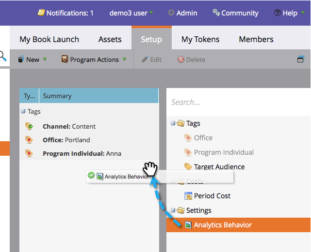
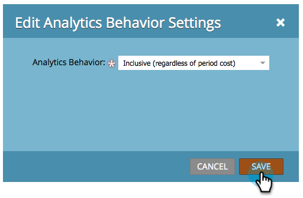

# 編輯Analytics行為設定 {#edit-analytics-behavior-settings}

您可以設定 [管道上管理員層級的Analytics行為](/help/marketo/product-docs/reporting/revenue-cycle-analytics/program-analytics/make-a-program-without-a-period-cost-available-in-revenue-explorer-and-analyzers.md)，但您也可以在方案層級進行編輯。 方法如下。

1. 前往 **行銷活動**.

   

1. 尋找並選取您的程式。

   

1. 在「設定」標籤下方，將「Analytics行為」拖曳至畫布上。

   

1. 選取您想要的Analytics行為。

   

>[!NOTE]
>
>**定義**
>
>**包含**  — 此選項將確保程式可用於在收入總管和分析器中報告，無論您是否包括期間成本。
>
>**運作**  — 此選項導致程式不會顯示在收入總管或分析器中。

>[!NOTE]
>
>預設行為（如果未套用此設定）是，只有在至少有一個期間成本（即使指派了零美元）時，程式才會包含在Analytics中。

1. 按一下 **儲存**.

   

幹得漂亮！ 現在您知道如何在程式層級覆寫分析行為了。

>[!NOTE]
>
>這些變更將在次日生效，該計畫將可供使用或從Revenue Explorer和分析器中提取。
