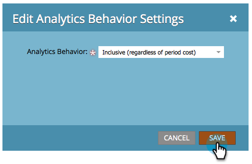

# 編輯分析行為設定 {#edit-analytics-behavior-settings}

您可以在頻道[的管理員層級設定](/help/marketo/product-docs/reporting/revenue-cycle-analytics/program-analytics/make-a-program-without-a-period-cost-available-in-revenue-explorer-and-analyzers.md){target="_blank"}分析行為，但您也可以在方案層級進行編輯。 方法如下。

1. 前往 **[!UICONTROL Marketing Activities]**。

   

1. 尋找並選取您的程式。

   

1. 在&#x200B;**[!UICONTROL Setup]**&#x200B;索引標籤中，將[!UICONTROL Analytics Behavior]拖曳到畫布上。

   

1. 選取所需的Analytics行為。

   

>[!NOTE]
>
>**定義**
>
>**[!UICONTROL Inclusive]** — 此選項將確保程式可用於在收入總管和分析器中報告，無論您是否包含期間成本。
>
>**[!UICONTROL Operational]** — 此選項導致程式無法顯示在收入總管或分析器中。

>[!NOTE]
>
>預設行為（如果未套用此設定）是，只有在至少有一個期間成本（即使指派零美元）時，程式才會包含在Analytics中。

1. 按一下「**[!UICONTROL Save]**」。

   

做得很好！ 現在您知道如何在方案層級覆寫分析行為了。

>[!NOTE]
>
>這些變更將在次日生效，該計畫將可供使用或從Revenue Explorer和分析器中提取。
