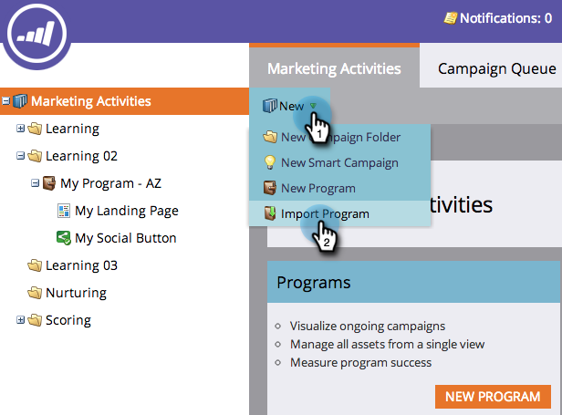

# 匯入方案 {#import-a-program}

程式可從一個Marketo訂閱匯入至另一個訂閱。 例如，您可以在沙箱中建立方案，然後將其匯入您的即時訂閱。 此外，您也可以從Marketo方案庫匯入預先建置的方案。

## 匯入方案 {#import-a-program-1}

1. 前往 **行銷活動。**

   

1. 按一下 **新增** 下拉。 選擇 **導入程式**.

   

   >[!NOTE]
   >
   >只有啟用了「導入程式」權限的角色的用戶才能使用「程式導入」。 深入了解 [管理使用者角色和權限](/help/marketo/product-docs/administration/users-and-roles/managing-user-roles-and-permissions.md).
   >
   >若要將沙箱帳戶連線至您的即時訂閱，請聯絡 [Marketo支援](https://nation.marketo.com/t5/Support/ct-p/Support).

1. 選取Marketo **訂閱** 和一個進口計畫。 按一下 **下一個**.

   

1. 指定 **促銷活動資料夾** 的URL。 按一下 **下一個。**

   

   >[!NOTE]
   >
   >請確定 **使用預設衝突** 規則。 將程式導入具有相同名稱的資產的實例時，需要衝突規則。

1. 預覽詳細資訊和 **匯入** 程式。

   

   對話框顯示程式導入進度。

   

匯入完成後，您會收到電子郵件確認。

>[!NOTE]
>
>您需要重新排程匯入的批次促銷活動，並啟動觸發促銷活動。 系統會自動停用促銷活動排程，並在匯入的方案中觸發促銷活動。

## 識別Marketo方案庫中預先建立的方案 {#identify-pre-built-programs-in-the-marketo-program-library}

Marketo方案庫包含預先建置、經過測試的方案，您可將這些方案匯入訂閱中。 可用的計畫包括：

1. **基本的滴灌。** 傳送依等待步驟分隔的一系列電子郵件。
1. **資料管理。** 使用智慧型行銷活動維護資料完整性。
1. **具有登錄頁面的電子郵件。** 傳送含有選件的初始電子郵件，例如「下載本白皮書」。 以確認或提醒電子郵件進行後續處理。 包含含表單的登錄頁面。
1. **具有晉升狀態的電子郵件。** 傳送含有可點按人員之可追蹤連結的郵件爆炸訊息。 更新每個人員的晉升狀態 — 已傳送、已開啟、已點按等。
1. **有趣的時刻。** 為您的銷售團隊創造有趣的時刻，讓他們保持循環。
1. **使用Autoresponder的登錄頁面。** 使用可下載的內容來吸引新人並培養他們。 包含登錄頁面和表單。
1. **生命週期2.** 使用分數將人員從新人移至符合行銷資格。
1. **行動電子郵件範本。** 針對iPhone和Android測試的回應式電子郵件範本。 某些版本的Android、MS Outlook、Exchange和協力廠商應用程式，例如Gmail和Yahoo! 郵件行動應用程式不支援回應式範本所需的CSS。 建議您在傳送電子郵件前先進行測試。
1. **方案匯入抽獎活動。** 抽獎活動計畫，供嘗試方案庫的人使用！ 只要核准電子郵件和登錄頁面，並啟用智慧型行銷活動即可。 然後檢視已核准的登錄頁面，填寫表單，然後您就進入了！
1. **可用銷售活動。** 讓您的銷售代表能夠從CRM的Dashboard執行Marketo智慧型行銷活動。
1. **得分 — Spark版。** 在單一計分欄位中擷取的人口統計和行為計分。 包括20多個與分數相關的促銷活動。
1. **計分 — 標準版和選定版。** 在個別計分欄位中擷取的人口統計和行為計分。 包括20多個與分數相關的促銷活動。
1. **將新人同步至CRM。** 將新人同步到您CRM系統的促銷活動。 它指派人員狀態，以便被認定為不適合銷售。
1. **使用事件轉接程式的網路研討會。** 完整的電子郵件集（例如邀請和提醒），以及包含表單和行銷活動的登錄頁面，可讓使用者透過計畫執行。 此程式會取得有關註冊、出勤等的更新。 來自線上事件提供商，如WebEx。
1. **不使用事件適配器的網路研討會。** 與上文相同，但需要手動記錄註冊、出勤等程式。
1. **天狼星決策評分程式**. 該程式旨在支援標準的Sirius決策評分模型，包括隱含和顯式評分規則以及矩陣人賦值。

>[!CAUTION]
>
>在匯入「計分 — 標準與選擇版本」程式之前，您必須建立兩個自訂欄位（「人口統計分數」和「行為分數」）。

## 程式匯入期間對外部資產的影響 {#impact-on-external-assets-during-program-imports}

程式會使用外部資產，例如電子郵件範本、登錄頁面範本、影像、表單、代號和程式標籤。 您可以設定如何處理登錄頁面範本和方案標籤，而Marketo會自動管理其餘內容。

**電子郵件/登錄頁面範本：** 電子郵件/登錄頁面範本會匯入Design Studio。 可以使用衝突規則來配置具有相同名稱的模板存在時的行為。 使用預設規則時，如果範本中存在同名的數字，則會附加該數字。 例如，如果您已有名為「標準範本」的範本，則新範本將命名為「標準範本1」。

**影像：** 除非存在同名影像，否則登錄頁面所使用的影像會匯入設計工作室。

**代號：** 在匯入程式期間，會將程式外部的代號轉換為本機代號。

>[!CAUTION]
>
>程式匯入不支援我的Token影像類型。 如果具有影像類型的程式會匯入我的代號， **no** 代號會到。

**程式標籤：** 您可以使用衝突規則來控制如何處理目標帳戶中不存在的程式標籤。 使用預設規則將建立程式標籤，或者您可以選擇忽略標籤。

**Forms:** 除非存在同名的外部表單，否則外部表單將自動導入設計工作室。

>[!CAUTION]
>
>匯入方案時，包含的電子郵件/登錄頁面 [動態內容](/help/marketo/product-docs/personalization/segmentation-and-snippets/segmentation/understanding-dynamic-content.md) 將被跳過。
