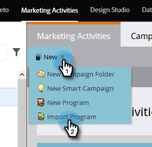

# 匯入方案 {#import-a-program}

程式可從一個Marketo訂閱匯入至另一個訂閱。 例如，您可以在沙箱中建立方案，然後將其匯入您的即時訂閱。 此外，您也可以從Marketo方案庫匯入預先建置的方案。

## 導入程式 {#importing-a-program}

1. 前往 **行銷活動。**

   

1. 按一下 **新增** 下拉。 選擇 **導入程式**.

   

   >[!NOTE]
   >
   >只有啟用了「導入程式」權限的角色的用戶才能使用「程式導入」。 深入了解 [管理使用者角色和權限](/help/marketo/product-docs/administration/users-and-roles/managing-user-roles-and-permissions.md).
   >
   >若要將沙箱帳戶連線至您的即時訂閱，請聯絡 [Marketo支援](https://nation.marketo.com/t5/Support/ct-p/Support).

1. 選取Marketo **訂閱** 和一個進口計畫。 按一下 **下一個**.

   

1. 指定 **促銷活動資料夾** 的URL。 按一下 **下一個。**

   

   >[!NOTE]
   >
   >請確定 **使用預設衝突** 規則。 將程式導入具有相同名稱的資產的實例時，需要衝突規則。

1. 選擇所需的衝突詳細資訊，然後按一下 **下一個**.

   

   >[!NOTE]
   >
   >將使用自定義流程步驟或從流程步驟服務派生的智慧清單規則的程式導入到多個相容服務提供商的目標實例中，系統將提示導入用戶將步驟或規則分配給目標實例中正確的服務提供商。

1. 預覽詳細資訊和 **匯入** 程式。

   

匯入完成後，您會收到電子郵件確認。

>[!NOTE]
>
>您需要重新排程匯入的批次促銷活動，並啟動觸發促銷活動。 系統會自動停用促銷活動排程，並在匯入的方案中觸發促銷活動。

## 程式匯入期間對外部資產的影響 {#impact-on-external-assets-during-program-imports}

程式會使用外部資產，例如電子郵件範本、登錄頁面範本、影像、表單、代號和程式標籤。 您可以設定如何處理登錄頁面範本和方案標籤，而Marketo會自動管理其餘內容。

**電子郵件/登錄頁面範本：** 電子郵件/登錄頁面範本會匯入Design Studio。 可以使用衝突規則來配置具有相同名稱的模板存在時的行為。 使用預設規則時，如果範本中存在同名的數字，則會附加該數字。 例如，如果您已有名為「標準範本」的範本，則新範本將命名為「標準範本 — 1」。

**登陸頁面/Forms:** 如果Design Studio中存在同名的表單或登錄頁面，系統仍會匯入這些表單或登錄頁面，但其名稱會附加數字(例如：登陸頁面 — 1)。

**影像：** 除非存在同名影像，否則登錄頁面所使用的影像會匯入設計工作室。

**代號：** 在匯入程式期間，會將程式外部的代號轉換為本機代號。

>[!CAUTION]
>
>程式匯入不支援我的Token影像類型。 如果具有影像類型的程式會匯入我的代號， **no** 代號會到。

**程式標籤：** 您可以使用衝突規則來控制如何處理目標帳戶中不存在的程式標籤。 使用預設規則將建立程式標籤，或者您可以選擇忽略標籤。

>[!CAUTION]
>
>匯入方案時，包含的電子郵件/登錄頁面 [動態內容](/help/marketo/product-docs/personalization/segmentation-and-snippets/segmentation/understanding-dynamic-content.md) 將被跳過。
