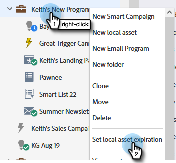

# 本地資產到期 {#local-asset-expiration}

設定到期日/時間以取消發佈登錄頁、停用觸發市場活動或停止定期批市場活動。

## 授予計畫資產到期權限 {#grant-schedule-asset-expiration-permission}

在計畫資產到期之前，您的Marketo角色必須啟用正確的權限。

>[!NOTE]
>
>**需要管理權限**

1. 在 [!UICONTROL 管理] 的 **[!UICONTROL 用戶和角色]**。

   

1. 按一下 **[!UICONTROL 角色]** 頁籤，選擇要授予訪問權限的用戶，然後按一下 **[!UICONTROL 編輯角色]**。

   

1. 下 [!UICONTROL 訪問市場營銷活動]選中 **[!UICONTROL 計畫資產到期]**。 按一下 **[!UICONTROL 保存]**。

PICC

## 設定到期日期 {#set-an-expiration-date}

1. 按一下右鍵所需的程式並選擇 **[!UICONTROL 設定本地資產到期]**。

   

1. 檢查要設定到期日期的資產，然後按一下 **[!UICONTROL 設定到期]**。

   

1. 選擇到期日期。

   

1. 設定時間。 您必須在將來安排至少20分鐘的時間（不要忘記輸入AM/PM）。 按一下 **[!UICONTROL 確認]** 完成。

   

>[!NOTE]
>
>* 要編輯現有到期日期，只需檢查資產並按一下 **[!UICONTROL 設定到期]**。
>* 資產一旦過期，將不再顯示在到期網格中。 網格將僅顯示已發佈的登錄頁、活動觸發市場活動和經常性批市場活動。

## 刪除到期日期 {#remove-an-expiration-date}

1. 要刪除到期日期，請檢查資產並按一下 **[!UICONTROL 刪除過期]**。

   

1. 查看受影響的資產，然後按一下 **[!UICONTROL 確認]**。

   

>[!NOTE]
>
>無法刪除將來時間不到15分鐘的過期日期。 要「刪除」到期日期，您需要等待資產到期，然後重新批准或重新激活它。
