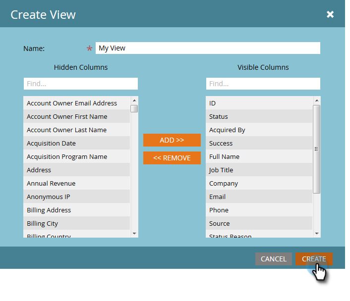

# 管理和查看成員 {#manage-and-view-members}

您可以使用「成員」頁簽管理和查看程式中的成員。

>[!NOTE]
>
>深入探討 [方案會籍](/help/marketo/product-docs/core-marketo-concepts/programs/creating-programs/understanding-program-membership.md).

## 搜索成員 {#search-for-a-member}

在「成員」部分的底部，使用搜索欄位按名稱、電子郵件、職銜或公司搜索方案成員。

1. 按一下 **成員** 頁簽。

   

1. 使用搜索欄位搜索成員清單。

   

## 導出成員網格 {#export-the-members-grid}

您可以按一下搜索欄位旁的Excel表徵圖導出成員清單。

## 管理成員網格中的列 {#manage-columns-in-the-members-grid}

拖放欄以變更其順序。 這對藍色箭頭表示欄將移至何處。

以滑鼠右鍵按一下欄標題，依字母順序排序，可依遞增或遞減順序排序。

## 選擇網格中可見的列 {#choose-which-columns-are-visible-in-the-grid}

1. 按一下 **檢視** 下拉式清單並選取 **建立檢視**.

   

1. 為自訂檢視命名。 選擇列標題。 按一下 **新增** 和 **移除** 移動列和建立視圖。

   

1. 按一下 **建立**。

   

## 篩選成員網格  {#filter-the-members-grid}

1. 按一下 **篩選** 下拉式清單中，並選取要排序的晉升步驟。

   

## 在成員網格中管理人員狀態 {#manage-person-status-in-the-members-grid}

您可以在成員網格內更改人員的狀態。

1. 按住 **Ctrl/Cmd** 並選取人。

   

1. 按一下 **更改狀態** 下拉式清單中選取狀態。

   

   這可能需要一些時間。 完成後，您會看到下面的訊息！

   

功能多，但都很簡單。 享受！

>[!MORELIKETHIS]
>
>[建立方案績效報告](/help/marketo/product-docs/core-marketo-concepts/programs/program-performance-report/create-a-program-performance-report.md)
