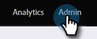

# 程式成員自定義欄位同步 {#program-member-custom-field-sync}

>[!PREREQUISITES]
>
>建立 [程式成員自定義欄位](/help/marketo/product-docs/core-marketo-concepts/programs/working-with-programs/program-member-custom-fields.md){target=&quot;_blank&quot;

>[!NOTE]
>
>程式成員對象最多可包含20個自定義欄位。 這些欄位可用於任何程式。

## 將Salesforce欄位映射到程式成員自定義欄位 {#map-salesforce-fields-to-program-member-custom-fields}

1. 在Marketo，按一下 **管理**。

   

1. 按一下 **Salesforce**，然後按一下 **編輯** 程式成員自定義欄位同步旁邊。

   

1. 使用搜索框查找要映射的Salesforce欄位。 在本示例中，我們使用「不呼叫」。

   

1. 按一下下拉框。

   

1. 選擇要映射的所需Marketo程式成員自定義欄位。

   

   >[!NOTE]
   >
   >下拉清單將僅顯示與Salesforce欄位的資料類型匹配的程式成員自定義欄位。

1. 對於其他欄位映射，請清除搜索框並重複步驟3至5。

1. 按一下 **保存** 完成。

   

   >[!IMPORTANT]
   >
   >將在Marketo和Salesforce之間向前同步映射欄位上對程式成員資料所做的更改。

   >[!NOTE]
   >
   >如果更名或更改Salesforce中某個欄位的資料類型，我們將刪除該欄位與Program Member Custom Field的任何映射。 但是，你可以在審閱後用新欄位重新映射它。

## 從程式成員自定義欄位取消映射Salesforce欄位 {#unmap-salesforce-fields-from-program-member-custom-fields}

如果要釋放某個欄位以替換它，或僅進行一般更改，則必須先執行取消映射。 這是方法。

1. 在Marketo，按一下 **管理**。

   

1. 按一下 **Salesforce**，然後按一下 **編輯** 程式成員自定義欄位同步旁邊。

   

1. 使用搜索框查找要取消映射的欄位。 在本示例中，我們使用「不呼叫」。

   

   >[!TIP]
   >
   >可以選擇 **已映射** 複選框，以僅查看映射的欄位。

1. 按一下 **X** 的子菜單。

   

1. 映射現在被刪除。 按一下 **保存**。

   

## 資料類型映射 {#data-type-mapping}

<table>
  <colgroup>
    <col/>
    <col/>
  </colgroup>
  <tbody>
    <tr>
      <th>SFDC資料類型</th>
      <th>程式成員自定義欄位資料類型</th>
    </tr>
    <tr>
      <td>文字</td>
      <td>字串</td>
    </tr>
    <tr>
      <td>選擇清單</td>
      <td>字串</td>
    </tr>
    <tr>
      <td>多選選擇清單</td>
      <td>字串</td>
    </tr>
    <tr>
      <td>電話</td>
      <td>字串</td>
    </tr>
    <tr>
      <td>電子郵件</td>
      <td>字串</td>
    </tr>
    <tr>
      <td>數(m)</td>
      <td>整數</td>
    </tr>
    <tr>
      <td>數(m,n)</td>
      <td>浮動</td>
    </tr>
    <tr>
      <td>複選框</td>
      <td>布林</td>
    </tr>
    <tr>
      <td>URL</td>
      <td>URL</td>
    </tr>
    <tr>
      <td>日期</td>
      <td>日期</td>
    </tr>
    <tr>
      <td>日期時間</td>
      <td>日期時間</td>
    </tr>
    <tr>
      <td>查找（引用）</td>
      <td>字串</td>
    </tr>
    <tr>
      <td>基64</td>
      <td>字串</td>
    </tr>
  </tbody>
</table>

>[!MORELIKETHIS]
>
>* [更改程式成員資料](/help/marketo/product-docs/core-marketo-concepts/smart-campaigns/program-flow-actions/change-program-member-data.md){target=&quot;_blank&quot;
>* [查看程式成員網格上的資料](/help/marketo/product-docs/core-marketo-concepts/programs/working-with-programs/manage-and-view-members.md){target=&quot;_blank&quot;

