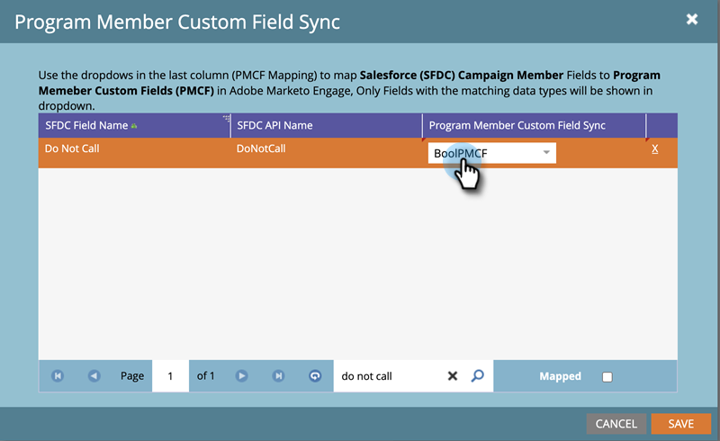

# 程式成員自訂欄位同步 {#program-member-custom-field-sync}

>[!PREREQUISITES]
>
>* 建立 [計畫成員自訂欄位](/help/marketo/product-docs/core-marketo-concepts/programs/working-with-programs/program-member-custom-fields.md){target="_blank"}
>* [將Salesforce行銷活動與程式同步](/help/marketo/product-docs/core-marketo-concepts/programs/working-with-programs/sync-an-sfdc-campaign-with-a-program.md){target="_blank"}

>[!NOTE]
>
>程式成員物件最多可以有20個自訂欄位。 這些欄位適用於任何計畫。

## 將Salesforce欄位對應到方案成員自訂欄位 {#map-salesforce-fields-to-program-member-custom-fields}

1. 在Marketo中，按一下 **管理員**.

   

1. 按一下 **Salesforce**，然後按一下 **編輯** 「程式成員自訂欄位同步」旁邊。

   

1. 使用搜尋方塊來找出您要對應的Salesforce欄位。 在此範例中，我們使用Do Not Call。

   

1. 按一下下拉式清單。

   

1. 選擇要對應的Marketo程式成員自訂欄位。

   

   >[!NOTE]
   >
   >下拉式清單只會顯示符合Salesforce欄位資料型別的方案成員自訂欄位。

1. 如需其他欄位對應，請清除搜尋方塊並重複步驟3到5。

1. 按一下 **儲存** 完成時。

   

   >[!IMPORTANT]
   >
   >對對應欄位上的計畫成員資料所做的變更，日後將會在Marketo和Salesforce之間同步。

   >[!NOTE]
   >
   >如果您在Salesforce中重新命名或變更欄位的資料型別，我們將移除該欄位與方案成員自訂欄位的任何對應。 但您可以在檢閱後使用新欄位重新對應。

## 從方案成員自訂欄位取消對應Salesforce欄位 {#unmap-salesforce-fields-from-program-member-custom-fields}

如果您想釋放欄位來取代它，或只是進行一般變更，則必須先執行取消對應。 方法如下。

1. 在Marketo中，按一下 **管理員**.

   

1. 按一下 **Salesforce**，然後按一下 **編輯** 「程式成員自訂欄位同步」旁邊。

   

1. 使用搜尋方塊來找出您要取消對應的欄位。 在此範例中，我們使用Do Not Call。

   

   >[!TIP]
   >
   >您可以選取 **已對應** 核取方塊以只檢視對應的欄位。

1. 按一下 **X** 欄位旁邊。

   

1. 對應現已移除。 按一下 **儲存**.

   

## 資料型別對應 {#data-type-mapping}

<table>
  <colgroup>
    <col/>
    <col/>
  </colgroup>
  <tbody>
    <tr>
      <th>SFDC資料型別</th>
      <th>程式成員自訂欄位資料型別</th>
    </tr>
    <tr>
      <td>文字</td>
      <td>字串</td>
    </tr>
    <tr>
      <td>挑選清單</td>
      <td>字串</td>
    </tr>
    <tr>
      <td>多選挑選清單</td>
      <td>字串</td>
    </tr>
    <tr>
      <td>電話</td>
      <td>字串</td>
    </tr>
    <tr>
      <td>電子郵件</td>
      <td>字串</td>
    </tr>
    <tr>
      <td>數字(m)</td>
      <td>整數</td>
    </tr>
    <tr>
      <td>數字(m，n)</td>
      <td>浮點數</td>
    </tr>
    <tr>
      <td>核取方塊</td>
      <td>布林值</td>
    </tr>
    <tr>
      <td>URL</td>
      <td>URL</td>
    </tr>
    <tr>
      <td>日期</td>
      <td>日期</td>
    </tr>
    <tr>
      <td>日期時間</td>
      <td>日期時間</td>
    </tr>
    <tr>
      <td>查詢（參考）</td>
      <td>字串</td>
    </tr>
    <tr>
      <td>Base64</td>
      <td>字串</td>
    </tr>
  </tbody>
</table>

>[!MORELIKETHIS]
>
>* [變更方案成員資料](/help/marketo/product-docs/core-marketo-concepts/smart-campaigns/program-flow-actions/change-program-member-data.md){target="_blank"}
>* [在方案成員網格上檢視資料](/help/marketo/product-docs/core-marketo-concepts/programs/working-with-programs/manage-and-view-members.md){target="_blank"}
>* [SFDC同步 — Campaign同步](/help/marketo/product-docs/crm-sync/salesforce-sync/sfdc-sync-details/sfdc-sync-campaign-sync.md){target="_blank"}
