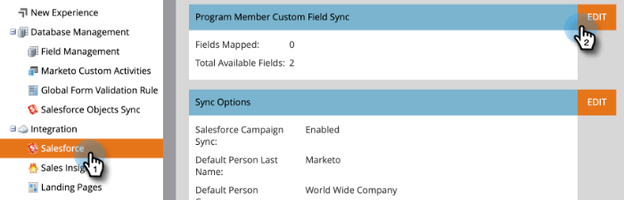

# 程式成員自定義欄位同步 {#program-member-custom-field-sync}

>[!PREREQUISITES]
>
>* 建立 [方案成員自定義欄位](/help/marketo/product-docs/core-marketo-concepts/programs/working-with-programs/program-member-custom-fields.md){target=&quot;_blank&quot;}
>* [將Salesforce促銷活動與方案同步](/help/marketo/product-docs/core-marketo-concepts/programs/working-with-programs/sync-an-sfdc-campaign-with-a-program.md){target=&quot;_blank&quot;}

>[!NOTE]
>
>程式成員對象最多可以有20個自定義欄位。 這些欄位可供任何方案使用。

## 將Salesforce欄位映射到程式成員自定義欄位 {#map-salesforce-fields-to-program-member-custom-fields}

1. 在Marketo中，按一下 **管理**.

   

1. 按一下 **Salesforce**，然後按一下 **編輯** 「程式成員自定義欄位同步」旁邊。

   

1. 使用搜索框查找要映射的Salesforce欄位。 在此範例中，我們使用Do Not Call。

   

1. 按一下下拉式清單。

   

1. 選擇要映射的Marketo計畫成員自定義欄位。

   

   >[!NOTE]
   >
   >下拉式清單只會顯示符合Salesforce欄位資料類型的方案成員自訂欄位。

1. 對於其他欄位映射，請清除搜索框並重複步驟3到5。

1. 按一下 **儲存** 時才能使用。

   

   >[!IMPORTANT]
   >
   >日後，Marketo和Salesforce之間將同步對已對應欄位上方案成員資料的變更。

   >[!NOTE]
   >
   >如果更名或更改Salesforce中欄位的資料類型，我們將刪除該欄位與方案成員自定義欄位的映射。 但在審核後，您可以用新欄位重新映射它。

## 從程式成員自定義欄位中取消映射Salesforce欄位 {#unmap-salesforce-fields-from-program-member-custom-fields}

如果您想要釋放欄位以取代該欄位，或只是進行一般變更，您必須先執行取消對應。 這是方法。

1. 在Marketo中，按一下 **管理**.

   

1. 按一下 **Salesforce**，然後按一下 **編輯** 「程式成員自定義欄位同步」旁邊。

   

1. 使用搜尋方塊來找出您要取消對應的欄位。 在此範例中，我們使用Do Not Call。

   

   >[!TIP]
   >
   >您可以選取 **已映射** 核取方塊，僅查看已對應欄位。

1. 按一下 **X** 欄位旁邊。

   

1. 現在已移除對應。 按一下 **儲存**.

   

## 資料類型對應 {#data-type-mapping}

<table>
  <colgroup>
    <col/>
    <col/>
  </colgroup>
  <tbody>
    <tr>
      <th>SFDC資料類型</th>
      <th>程式成員自定義欄位資料類型</th>
    </tr>
    <tr>
      <td>文字</td>
      <td>字串</td>
    </tr>
    <tr>
      <td>選擇清單</td>
      <td>字串</td>
    </tr>
    <tr>
      <td>多選選擇清單</td>
      <td>字串</td>
    </tr>
    <tr>
      <td>電話</td>
      <td>字串</td>
    </tr>
    <tr>
      <td>電子郵件</td>
      <td>字串</td>
    </tr>
    <tr>
      <td>數(m)</td>
      <td>整數</td>
    </tr>
    <tr>
      <td>數(m,n)</td>
      <td>浮點數</td>
    </tr>
    <tr>
      <td>核取方塊</td>
      <td>布林值</td>
    </tr>
    <tr>
      <td>URL</td>
      <td>URL</td>
    </tr>
    <tr>
      <td>日期</td>
      <td>日期</td>
    </tr>
    <tr>
      <td>日期時間</td>
      <td>日期時間</td>
    </tr>
    <tr>
      <td>查閱（參考）</td>
      <td>字串</td>
    </tr>
    <tr>
      <td>Base64</td>
      <td>字串</td>
    </tr>
  </tbody>
</table>

>[!MORELIKETHIS]
>
>* [更改計畫成員資料](/help/marketo/product-docs/core-marketo-concepts/smart-campaigns/program-flow-actions/change-program-member-data.md){target=&quot;_blank&quot;}
>* [在方案成員網格上查看資料](/help/marketo/product-docs/core-marketo-concepts/programs/working-with-programs/manage-and-view-members.md){target=&quot;_blank&quot;}
>* [SFDC同步 — 促銷活動同步](/help/marketo/product-docs/crm-sync/salesforce-sync/sfdc-sync-details/sfdc-sync-campaign-sync.md){target=&quot;_blank&quot;}

