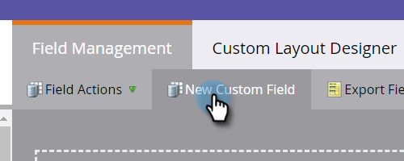
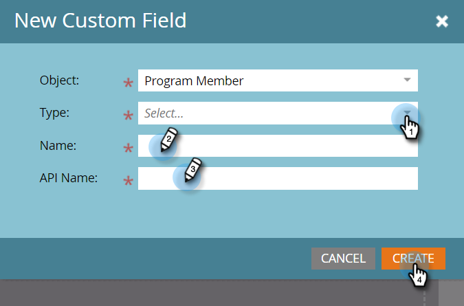

# 方案成員自定義欄位{#program-member-custom-fields}

方案會員自訂欄位可讓您收集每個會員的方案專屬資料。 它們可用於：Marketo表單、智慧型清單篩選和觸發器，以及智慧型促銷活動流量動作。 可在程式的「成員」(Members)頁籤中查看資料。

>[!NOTE]
>
>「方案會員」自訂欄位目前未與「Salesforce促銷活動會員」欄位整合。

## 建立程式成員自定義欄位{#create-a-program-member-custom-field}

1. 在Marketo中，按一下&#x200B;**管理**。

   

1. 按一下&#x200B;**欄位管理**。

   

1. 按一下「**新建自定義欄位**」。

   

1. 按一下「物件」下拉式清單，並選取所要的物件。

   

   >[!NOTE]
   >
   >「人員」和「方案會員」自訂欄位不能共用相同的名稱。

1. 填寫剩餘欄位，然後按一下「建立」。****

   

   >[!NOTE]
   >
   >「方案成員」自定義欄位支援的類型包括：布林值、日期、日期時間、浮點、整數、字串、URL。 [進一步瞭解欄位類型](/help/marketo/product-docs/administration/field-management/custom-field-type-glossary.md)。

## 物件說明{#object-descriptions}

| 物件 | 說明 |
|---|---|
| 公司 | 與人員關聯的公司名稱。 |
| 機會 | 機會可以與個人或帳戶關聯，作為潛在的未來銷售。 他們通常透過CRM或API進入Marketo。 |
| 人物 | 您透過行銷宣傳參與的Marketo資料庫中的個人。 |
| 方案會員 | 同為方案成員的人員 |

## 觸發器和篩選器{#triggers-and-filters}

您可以透過[triggers](/help/marketo/product-docs/core-marketo-concepts/smart-campaigns/creating-a-smart-campaign/define-smart-list-for-smart-campaign-trigger.md)和／或[filters](/help/marketo/product-docs/core-marketo-concepts/smart-lists-and-static-lists/creating-a-smart-list/find-and-add-filters-to-a-smart-list.md)，在智慧型清單中運用此程式特定資料。

## 要知道的{#things-to-know}

* 方案會員自訂欄位僅適用於本機資產。 Design Studio不支援這些功能，因為無法將它與特定程式連結。
* 您無法將包含「Program Member」自訂欄位的表單（或含表單的著陸頁面）複製／移動至Design Studio。
* Program Member對象最多可以有20個自定義欄位。 這些欄位可用於任何程式。
* 刪除程式成員時，如果他們在其「程式成員」自定義欄位中有任何資料，則會從該欄位中刪除資料。
* 要查看資料，請按一下程式中的「成員」頁籤並建立包含該欄位的自定義視圖。
* 支援透過[list](/help/marketo/getting-started/quick-wins/import-a-list-of-people.md)和[API](https://developers.marketo.com/)匯入和匯出。
* 當您合併兩個人時，將會使用贏家的方案會員自訂欄位資料。 但如果成功者沒有，則會使用失敗者的值。

>[!MORELIKETHIS]
>
>[在Marketo中建立自訂欄位](/help/marketo/product-docs/administration/field-management/create-a-custom-field-in-marketo.md)
