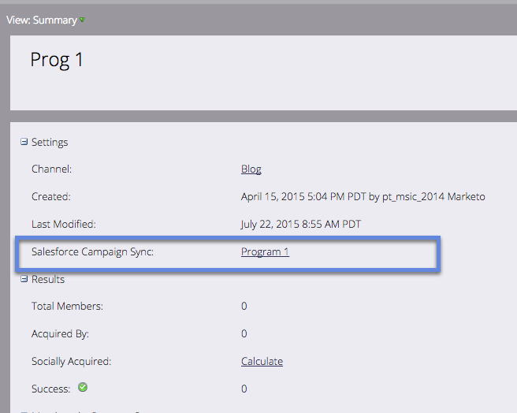

# 將SFDC促銷活動與計畫同步 {#sync-an-sfdc-campaign-with-a-program}

Marketo可讓您將方案與Salesforce促銷活動同步，以維護兩個系統中相同的人員清單，包括其狀態。 開始吧！

>[!PREREQUISITES]
>
>您需要 [啟用Salesforce促銷活動同步](/help/marketo/product-docs/crm-sync/salesforce-sync/setup/optional-steps/enable-disable-campaign-sync.md) 第一個。

>[!CAUTION]
>
>將SFDC促銷活動與Marketo計畫同步時，該計畫的子促銷活動將禁用隱含的SFDC操作（例如，添加到SFDC促銷活動，同步到SFDC）。

1. 前往 **行銷活動**.

   

1. 選取您的方案。

   

1. 按一下 **計畫操作**，然後選取 **Salesforce促銷活動同步**.

   

1. 選擇 **新建** 或選擇現有的Salesforce促銷活動。

   >[!TIP]
   >
   >如果您選取現有的Salesforce促銷活動，請務必 [匹配Salesforce促銷活動和Marketo計畫的方案狀態](/help/marketo/product-docs/crm-sync/salesforce-sync/sfdc-sync-details/how-to-match-program-statuses-and-salesforce-campaign-statuses-prior-to-sync.md).

1. 輸入新促銷活動的名稱，然後按一下 **儲存**.

   

1. 現在，您可以在方案摘要頁面中驗證促銷活動同步詳細資訊。

   

   太棒了！ 現在，Marketo中的任何計畫狀態變更都會同步至SFDC促銷活動，反之亦然。
