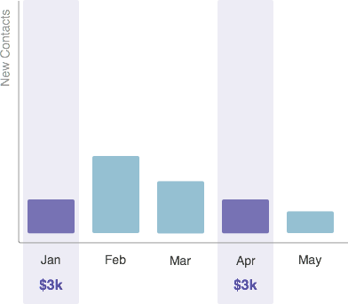

# 了解期間成本 {#understanding-period-costs}

## 總覽 {#overview}

期間成本是指您在某個特定月份花在某個計畫上的資金。

>[!NOTE]
>
>**範例**
>
>如果你花1000美元為7月推出的電子書聘請插畫師，電子書計畫在7月的時間成本為1000美元。
>
>如果您每月在Google Adwords上花費$200 -Google Adwords計畫的期間成本為$200 **每個月**.

>[!NOTE]
>
>[了解方案](/help/marketo/product-docs/core-marketo-concepts/programs/creating-programs/understanding-programs.md)
>
>[了解方案會籍](/help/marketo/product-docs/core-marketo-concepts/programs/creating-programs/understanding-program-membership.md)

## 如何計算期間成本 {#how-period-costs-are-calculated}

想像一下3月舉辦的活動，如網路研討會。 新人將在一、二月份從廣告中預先收購。 活動結束後，人們將在4月和5月下載網路研討會，屆時還會獲得新的聯繫人。

1. 將單期成本歸因於3月……

   

   ...在之前和之後的月份中添加的聯繫人 *僅限* 數到三月。

   

1. 期間成本歸因於1月、2月和3月……

   

   ...只有在3月之後的月份新增的聯絡人數，才會計入3月。

   

1. 期間成本計入1月和4月……

   

   ...在1月到3月的月份中新增的聯絡人數將計為1月。 4月和5月新增的聯絡人數將計為4月。

   

   >[!NOTE]
   >
   >摘要 — 沒有定義期間成本的月份會「回溯」到已定義的最後一個月份。 如果沒有前期成本，則月份將「前轉」到已定義的下一個月份。 如果尚未為 _any_ 數月後，該計畫將無法使用RCE報告。

   >[!MORELIKETHIS]
   >
   >* [在方案中使用期間成本](/help/marketo/product-docs/core-marketo-concepts/programs/working-with-programs/using-period-costs-in-a-program.md)
   >* [按期間成本篩選方案報表](/help/marketo/product-docs/core-marketo-concepts/programs/program-performance-report/filter-a-program-report-by-period-cost.md)

