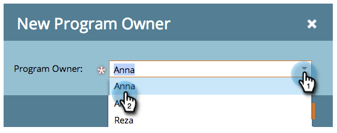

# 在程式中使用標籤 {#use-tags-in-a-program}

標籤是描述程式的屬性，用於在報告中將程式型別分組。

>[!NOTE]
>
>如果您使用「收入週期總管」，則必須定義期間成本（即使是0），才能讓報表可用於程式。

## 在程式中使用標籤 {#use-a-tag-in-a-program}

1. 選取您的程式。 按一下&#x200B;**設定**。

   

1. 將標籤拖放至畫布上。

   

1. 從下拉式清單中選取值。

   

1. 按一下&#x200B;**保存**。

   

1. 右上。 您會在畫布中看到新標籤。

   

## 編輯標籤 {#edit-a-tag}

1. 前往&#x200B;**設定**&#x200B;標籤。 以滑鼠右鍵按一下標籤。 選取&#x200B;**編輯**。

   

1. 按一下下拉式清單。 選取新值。

   

1. 按一下&#x200B;**保存**。

   

1. 太棒了！ 您應該會看到所做的編輯反映在畫布中。

   

## 刪除標籤  {#delete-a-tag}

1. 前往&#x200B;**設定**&#x200B;標籤。 用滑鼠右鍵按一下標籤，然後選取&#x200B;**刪除**。

   

1. 按一下&#x200B;**刪除**&#x200B;確認。

   

做得很好！具有一致標籤的程式可讓您在執行報表時更輕鬆。
